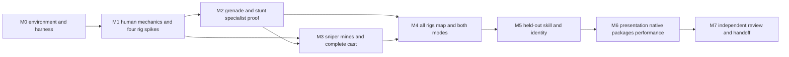

# Implementation runbook: one sustained kickoff, M0–M7

Version **0.2**, 2026-09-08. This is an implementation handoff, not execution evidence. Scripts, project targets, command examples and checkpoints below are deliverables to implement and qualify. No engine installation, project compilation, native package, learned policy or Fable review is claimed complete. The user requested research/specification before implementation; this document does not itself start installation or game development.

Read [SPEC.md](SPEC.md), [BOT-CAST.md](BOT-CAST.md), [DAY1-ENGINEERING.md](DAY1-ENGINEERING.md), [ACCEPTANCE.md](ACCEPTANCE.md), then the relevant research appendix. Latest user instructions outrank this plan. Preserve hard requirements through repairs and fallback choices; record changes to tuning or architecture with checked evidence in `DECISIONS.md`.

## 1. The result to deliver

Build an original offline 4v4 game: one human plus **arcl1ght, hotlap, stitch3r, farsight, b0bbin, ramrod and lattice**, with no generic filler. Deliver native Apple Silicon Mac and Windows x64 packages, **Fort Crossing**, **Holdout and CTF**, and all required weapons: pistol, portable machine gun, charged sniper with visible laser, drop/charged-throw grenades in timed/impact modes, and planted laser mines.

All four vehicles are mandatory: buggy four wheels/two seats, Hummer-style utility four/four, truck six/five and dirtbike two/one. Establish excellent human arcade handling before judging bot driving. Tire damage changes real handling; propulsion disables at 3/4, 3/4, 4/6 and 2/2 failed tires respectively while coasting remains physical. Include passenger combat, controlled entry/exit/bailout, visible recovery, abandonment/destruction and one replacement per original base slot. Each team has one slot for each family.

The finished game includes recognizable specialist behavior, complete objective/respawn/rematch loops, settings/input/audio/UI, required b0bbin Russian-accented contextual jokes, native performance evidence and human evaluation. Runtime MCP, LLM services and editor Python are not dependencies. The archived online plan supplies no active tasks.

“One shot” means sustained autonomous implementation across these gates, with measured corrections and checkpoints. It does not promise one response, one attempt or a calendar duration. Continue independent useful work during external/human waits, while leaving the affected gates visibly incomplete.

## 2. Durable inputs and command contracts

Use DAY1's canonical files. Do not create a competing lock, status document or backlog:

```text
PROJECT-LOCK.json                 exact engine/toolchain/source/content identities
IMPLEMENTATION-STATE.md           current gate, owners, running jobs, next action
DECISIONS.md                      checked decisions and reopening conditions
ContentRecipe/                   asset/map/rig/profile source recipes
Verification/checks.json          named checks, prerequisites, platform and evidence class
Verification/residuals.json       unfinished obligations, owners and next actions
Verification/schemas/             strict versioned artifact schemas
Scripts/doctor.py                 read-only prerequisite/lock inspection
Scripts/build.py                  native UBT/UAT wrapper
Scripts/generate_content.py       editor Python recipe execution
Scripts/validate_content.py       engine-native asset/reference inspection
Scripts/run_scenarios.py          bounded process supervision and report collection
Scripts/collect_evidence.py       hashes and finalized evidence index
Scripts/check.py                  registry selection and aggregate verdict
Scripts/classify_change.py        conservative change-to-gate selection
Scripts/editor_lease.py           editor mutation ownership
Scripts/checkpoint.py             operation publication and resume
Scripts/validate_governance.py    requirement/decision/residual consistency
Saved/AgentState/                 local operation state and leases
Saved/Verification/<run-id>/      fresh run outputs and immutable completed evidence
```

The ordinary scripts use the recorded host Python; generation and engine inspection run inside the qualified editor interpreter. All wrappers accept explicit absolute project/output paths, run ID and selected platform/configuration. They validate the lock and operate on argument vectors, not interpolated shell strings. Record actual argv, working directory, environment overrides, source/content digests, start/end, process exits, timeouts and report inventories. Missing tools or reports must produce an actionable nonpassing result.

`build.py` needs separate editor-build, game-build and package operations. `run_scenarios.py` selects a registered scenario family, passes the run identity to the actual executable and enforces expected named cases. `collect_evidence.py` verifies completed outputs, hashes the package and writes the final manifest last. A successful tool response or old output folder cannot qualify the result.

Editor-only C++ lives in a declared editor module/plugin; `Build/AgentTools/`, if used, contains configuration/bootstrap sources only. Unreal does not discover reflected code there automatically. Qualify actual Python loader/tool registration and restart discovery. Generated-content ownership must remain distinct from hand-authored assets.

## 3. Dependency order and scope of evidence



The graph permits bounded parallel work; it does not allow a specialty to pass before its weapon/vehicle mechanics exist. M3 may implement sniper/mines while M2 refines grenade/stunt control. Final M3 cast qualification incorporates the established specialist controllers. Presentation work can begin early, but M6 completes its acceptance. Any physics/weapon/perception change invalidates affected earlier skill evidence.

Each milestone reports required cells separately: hermetic, engine, package, rendered and human, with native platform/configuration. A source-only prototype can advance useful work when a host is unavailable; the milestone stays incomplete until its mandatory native cells run. Do not represent a minimal boot as complete cast or performance acceptance.

## 4. M0 — prerequisites, harness and minimal native boot

Inspect/preserve the existing directory and any Git changes. Initialize version control during authorized implementation if still absent, then establish binary asset handling and verify a fresh checkout obtains actual files. Inspect available agent tools and actual Fable integration without inventing executable names. Capture current free space, memory, engine locations, full Xcode/SDK and Windows access; earlier machine observations are historical only.

Start qualification with installed UE 5.8.2 distributions. Recheck the available stable patch at kickoff and record the selected build; upgrades require explicit requalification. Use compatible full Xcode, beginning with the documented 26.1 line/26.1.1 recommendation; 5.8.2's known issue covers Xcode 26.4 or newer. Windows needs the engine-supported compiler/SDK combination. No source-engine build is required. [Platform requirements and source caveats](research/PLATFORMS-AND-AGENTS.md)

Create the minimal C++ game/editor targets, bootstrap map, menu/exit path and shared action/perception seam. Define all seven profile IDs and four rig IDs in versioned data without pretending their behavior is finished. Build, package and render a native minimal boot on each available host. A missing host remains a prerequisite row, not a silent platform downgrade.

Implement the smallest DAY1 registry, manifests, supervisor self-checks, change classifier, editor lease and checkpoint protocol. Qualify native MCP through create/save/restart/read-back and one real named automation test; qualify editor scripting if MCP fails. Test actual child nonzero exits, zero-case reports, stale identities and latched timeouts. Exercise one fixture interruption and one lease contender. Exclude automation modules from the minimal delivered targets now, then verify again on final packages.

Exit: exact environment records, native boot evidence, working harness against fixtures, initial positive/occluded observation seam and explicit pending product obligations. No bot-human resemblance claim is possible at M0.

## 5. M1 — human mechanics and all four early vehicle risks

Implement shared local world/life generations, pause/reset rules, infantry movement, kit burden, health/hit classification, pistol/MG, recoil/reload, depots and basic respawn. Implement both grenade modes, charge/drop controls, inherited platform velocity, blocked releases, blast occlusion and unique damage resolution. Establish fixtures for short/long/high/low shots, low-frame-rate impacts and moving platforms. Verify the 180–220 m impact-mode envelope without extending the timed fuse or correcting flight.

Build the reference buggy with real suspension/contact, passenger combat, tire damage, exits/bailout, visible recovery and base-slot lifecycle. Test damage on slopes/turns, disabled coasting and repeated destroy/return callbacks. Develop the human course: launch, braking, powerslide/180, rough line, rock-lip/ramp jump, wall brush and landing. Obtain user handling feedback while independent work proceeds; do not compensate for disliked human handling with privileged bot forces.

**Prototype all four families in this milestone.** Demonstrate utility seat capacity, six working truck contacts/four passengers, and actual two-wheel bike balance/lean/landings. A proxy rig is enough to reveal feasibility, but decorative wheels or an invisible four-wheel bike are not. Record unresolved physical/rig problems immediately; solve their mechanism before committing large amounts of dependent art or training.

Exit: playable human practice, actual shared grenade behavior, qualified reference buggy, measured risk report for every family and versioned handling inputs. Vehicle visuals may remain graybox; failed human handling remains open.

### Reproducible content bootstrap

Create the asset pipeline while building M0/M1 fixtures, then preserve it through final art:

1. **Inventory before acquisition.** Record available engine/template/sample content and qualified authoring tools. Add stable IDs, source/license evidence, source-file hashes and intended Unreal paths to `ContentRecipe/assets.json`. A paid marketplace pack, remote image-to-3D service or compatible vehicle rig is not an assumed prerequisite. Mark absent content explicitly; do not let the editor silently replace missing meshes or animations.
2. **Generate the useful graybox first.** Use ordinary engine primitives and simple project-authored materials for terrain blocks, fort walls, targets, weapon stand-ins, mine casings and vehicle-course geometry. Keep transforms, dimensions, collision and semantic tags in recipes. These can establish mechanics before production meshes. A screenshot of a primitive car cannot satisfy the physical rig gate.
3. **Author four minimal original source rigs.** Keep editable source under task-owned `SourceArt/vehicles/<rig-id>/`. Use a repeatable source-art script through an actually available, qualified authoring tool, or qualified engine mesh/skeleton authoring APIs. Choose and record one working path; no additional engine plugin becomes mandatory without qualification. Build simple chassis/wheel geometry at measured dimensions, with explicit units, X-forward/Z-up orientation, root/wheel hierarchy, wheel centers/radii, four/six/two physical contacts, seat/entry/muzzle sockets, chassis collision and suspension clearances. A scriptable DCC/export step is an option to qualify, not a claim that a compatible DCC is already installed. Preserve its script, source scene, exporter settings and output hashes.
4. **Import one rig end to end before batching.** Import with explicit recipe settings; inspect skeleton/bones, material slots, physics asset, collision dimensions and wheel placement in Unreal. Create handling/seat/tire data and animation bindings, save, restart and read back. Run the human contact/steer/brake/damage fixture, then unattended cook/reference validation and a native package launch. Reuse the proven import path for the other three rigs while preserving their real wheel/seat differences. If a specific authoring/export capability is unavailable, name that missing step and continue independent mechanics; do not falsely qualify an unrigged placeholder.
5. **Establish one infantry animation contract.** Select one available, appropriately licensed common skeleton/animation source or author a minimal original equivalent. Pin the hierarchy and weapon sockets. Provide locomotion, aim offsets, fire/reload, grenade charge/release/drop, mine placement, seated driver/passenger, bike lean, entry/exit, recovery and death transitions. Simple authored poses/keyframes can establish state correctness; final readability and camera/limb quality are M6 obligations. Distinct character behavior must survive shared skeletons and hidden cosmetics.
6. **Replace placeholders through validation.** A final asset must retain the stable logical ID, dimensions/collision semantics, sockets, functional rig and recipe provenance; include suitable LOD/material/audio budgets. Reimport cannot reset wheel health mapping or invalidate seat arcs. Run affected human/bot fixtures and unattended cooked-reference checks after replacement. At M6 inspect visible clipping, aiming, reloads, passengers, bike lean, tire deformation and voice timing in actual native packages. Source or license gaps remain blockers for the corresponding final asset.

## 6. M2 — arcl1ght and hotlap feasibility

Build fair observation snapshots, aged beliefs, legal action outputs and reusable skill instrumentation. Demonstrate arcl1ght executing practiced distance/height/platform throws through the human grenade interface. Separate accurate motor placement from predicting an observed person. Permit real late-dodge misses; prohibit hidden target state, enormous perfect runtime world searches, bot-specific impulse or homing corrections.

Implement vehicle affordance/maneuver candidates beyond road splines. hotlap selects and executes human-reproducible powerslides, rough lines, ramp approaches and recoverable fort-style entries. Record takeoff, input sequence, landing, recovery and failed attempts. Rigid scripted animations or teleported landings cannot count. Use several geometry variants and blocked-route cases to expose memorization.

Begin with authored/calibrated controllers. If a measured motor deficit justifies learning, run a bounded demonstration/policy experiment with the recording/split contracts already in place. Do not make training a dependency for unrelated gameplay. An ordinary controller that drives slowly around roads is not an acceptable substitute for the specialty.

Exit: provisional specialist competence/fairness evidence and human-reproducible baseline trajectories. Freeze its physics/controller revision. Reopen these results after relevant later tuning; the initial impressive examples are not sealed final acceptance.

## 7. M3 — skill dependencies and the complete cast

Complete the charged sniper, scope and common visible laser before evaluating farsight. Complete planted laser mines before evaluating lattice: placement preview/endpoints, arming, finite carried/active caps, actual swept beam crossings, visible settings, safe shooting/removal, spawn exclusion, cleanup and resupply. A proximity trigger cannot replace the laser beam. Test fast targets and multiple placements in one frame.

Implement stitch3r's sustained MG tracking/recoil/angles; farsight's sniper relocation and controlled driving; ramrod's fast vehicle-to-MG assaults; b0bbin's competent basic interactions, weaker judgment and occasional earned successes; lattice's varied traps and adaptation. Preserve the detailed [cast contract](BOT-CAST.md) and prior specialist work. Names, cosmetics and weapon preference alone do not establish distinct behavior.

Each character must travel, fight on foot, resupply, participate in objectives and recover when its preferred tool is absent. Create local event/subtitle banter structure now; performed/licensed b0bbin voice is required at M6. Pair same-weapon and comparable-opportunity tests so stitch3r/ramrod and the skilled drivers remain distinguishable beyond equipment.

Exit: all seven profiles instantiate independently with real skill dependencies, bounded recovery and legal observations/actions. Dynamic targets/traps/blockers cannot be read through global hidden-state arrays. Full-match integration is still pending.

## 8. M4 — complete rigs, Fort Crossing and both modes

Finish all four physical rigs, seat poses/arcs/collision, passenger visibility/fire, tire states and lifecycle. Populate eight base slots with one family per team. Repeated possession, blocked exit, stop requests, bailout, destruction and replacement must preserve one body/control owner and one live vehicle per slot. Test restoration of wheels, seats and objectives on a new generation.

Generate Fort Crossing from original recipe geometry: settlements, central fort, covered foot approaches, open/rough vehicle lines, ramps/berms and viable landing areas. Measure legal opening arrival times and initial base-route symmetry. Do not hide invisible barriers around stunt destinations. Validate collision, navigation, spawns, kill/return boundaries and objective anchors.

Implement Holdout's persistent terminal ownership and chronological score/claim/time-limit resolution. Implement CTF's Home/Carried/Dropped conservation, own-flag-home capture condition, timed return, uninterrupted possession lease and carried burden/vehicle behavior. Use the specified cancellation, friendly-fire/Classic Traps, ramming and spawn protection rules; a generic capture circle is not Holdout.

Run complete offline matches in both modes through warmup, active play, results and rematch with the full cast. Exercise both ordinary play and pathological resets: armed mines, airborne grenades, occupied/damaged vehicles, active objectives and pending bot jobs. Pause must freeze gameplay time and resumed old-generation work must be rejected.

Exit: complete playable graybox on both platforms, all mode/roster/rig content present and reproducible. It is ready for serious identity/feel evaluation, not automatically a polished release.

## 9. M5 — held-out motor and character evaluation

Freeze source/content/physics/profiles and the development/validation/acceptance manifests. Split any demonstrations by session, player and layout before training; never adjacent frames from one recording. Evaluate held-out terrain variants, target motion, approach directions, damage, blocked routes, recovery and finite supplies. Acceptance data used for tuning is reopened and replaced with fresh holdouts.

Learning remains optional. If adopted, separately qualify training host and the exact cooked model/runtime on Mac and Windows, including memory, output schema, inference budget, cancellation and fallback behavior. A functioning fallback cannot pass an expert gate unless it independently meets the same criterion.

Collect complete or preselected random sequences/full sessions, preserving failures. Human evaluation hides names/cosmetics/voice for one recognition condition and restores them for the complete experience. Compare comparable specialists and human demonstrations in this game. Record participants, familiarity, sample size, uncertainty, exclusions and inconclusive outcomes. The user judges whether these feel like the requested people; reviewers can challenge evidence but cannot manufacture that judgment.

Exit: documented competence/fairness/identity/variety/recovery results. Iterate based on evidence until mandatory criteria pass, then freeze the revised candidate and requalify affected cells.

## 10. M6 and M7 — presentation, review and delivery

M6 completes coherent art/animation/audio, first-person/passenger/driver/bike cameras, settings/rebinding, readable sniper/mine cues at minimum quality, tire feedback, pause/results and subtitles. Finish b0bbin's original or appropriately licensed Russian-accented contextual jokes, with local playback and repetition/mute controls. Subtitles alone no longer satisfy his presentation obligation.

Build fresh native Development and Shipping packages. Test start/play/rematch/exit outside the editor with developer agents absent. Verify cooked inventories and automation-module exclusion. Run the exact SPEC performance fixture and thresholds on recorded target hardware: rendered full cast, eight awake vehicles, 64-mine stress, measured warmup/window, frame-time percentiles, bot CPU budget, memory and repeated-match growth. Preserve output resolution/upscaling and resource-load conditions. Optimize without removing mandatory content or granting unfair controls.

M7 assembles Fable's independent packet and actual available Astra review, dispositions every finding, applies accepted repairs and re-verifies final artifact identities. Keep `accepted`, `rejected` and `unresolved` separate, with evidence and reopeners. If the user invokes Fable externally, supply the concrete packet and incorporate the returned findings; until then record its review as pending. Human evaluation also remains pending until it actually occurs.

Deliver native packages, checksums, compact evidence index, reproducible commands/content recipes, licensing provenance, measured limitations and a maintenance handoff. Report what was implemented, executed, natively rendered, human-evaluated and still incomplete. Public publication/signing/storefront work is a separate scope decision.

## 11. Engineering obligations mature with their subjects

All sixteen DAY1 IDs are mandatory; this allocation controls when they can honestly complete:

| IDs | Initial evidence | Final closure |
|---|---|---|
| ENG-001–005 | M0 native environments, automation, harness, inventory and identity fixtures | Revalidate against final environments/packages at M6–M7 |
| ENG-006–009 | M0 fixture generation and lease/recovery; classifier and governance validator register as `pending` until the first commit gives them a base; pending never satisfies ENG acceptance, and after the first commit the entire initial tree is validated against the empty-tree baseline with passing classifier/governance receipts before ENG-006–009 complete (D-017) | M1–M4 actual content/async operations; recheck impacted paths |
| ENG-010 | M0 actionable prerequisite/unbuilt obligations | Every gate and final ledger reconciliation |
| ENG-011 | M0 visible/occluded seam | M2–M5 every actual skill/caller/cache and counterfactual probe |
| ENG-012 | M0 seven canonical profile IDs | M3 generated profiles and M4–M6 packaged cast |
| ENG-013 | M0 manifests/split policy | M2–M5 actual data, holdouts and any training provenance |
| ENG-014 | M0 rendered boot | M4–M6 rendered gameplay, input/audio and performance |
| ENG-015–016 | M0 review/report schemas | Actual M7 independent review and final truthful delivery |

A future-content check has `pending` milestone status and an explicit obligation; it is not a passing executed case. Apply DAY1's defined runner outcomes to checks actually selected. Do not label all ENG IDs green because their filenames or empty schemas exist.

## 12. Illustrative native command shapes

These are **unexecuted templates**. Resolve actual paths, target names, commandlet executable, architecture, maps and UAT flags through the installed engine/help. Wrappers log the final argument vectors and observe their real exits. Configure explicit cook inclusion before packaging; use fresh output directories. No command below authorizes execution during this research turn.

```sh
"/ABS/UE/Engine/Build/BatchFiles/Mac/Build.sh" MobileForces2027Editor Mac Development -Project="/ABS/PROJECT/MobileForces2027.uproject" -WaitMutex

"/ABS/MAC_EDITOR_COMMANDLET" "/ABS/PROJECT/MobileForces2027.uproject" -run=pythonscript -script="/ABS/PROJECT/Scripts/generate_content.py" -unattended

"/ABS/UE/Engine/Build/BatchFiles/RunUAT.sh" BuildCookRun -project="/ABS/PROJECT/MobileForces2027.uproject" -platform=Mac -clientconfig=Development -build -cook -stage -pak -archive -archivedirectory="/ABS/EVIDENCE/RUN-ID/Package" -unattended
```

```powershell
& 'C:\ABS\UE\Engine\Build\BatchFiles\Build.bat' MobileForces2027Editor Win64 Development '-Project=C:\ABS\PROJECT\MobileForces2027.uproject' -WaitMutex

& 'C:\ABS\UE\Engine\Build\BatchFiles\RunUAT.bat' BuildCookRun '-project=C:\ABS\PROJECT\MobileForces2027.uproject' -platform=Win64 -clientconfig=Development -build -cook -stage -pak -archive '-archivedirectory=C:\ABS\EVIDENCE\RUN-ID\Package' -unattended
```

Use Shipping configuration for its separate package/smoke. A wrapper must inspect PowerShell's actual native-process exit; printed errors are not its only verdict channel. Engine Python/commandlets also require qualified error/report propagation. See [automation research](research/UNREAL-AUTOMATION.md) for primary command documentation and limitations.

## 13. Copy-ready implementation kickoff

```text
Implement the current Mobile Forces 2027 v0.2 specification in this workspace.
Read SPEC, BOT-CAST, ACCEPTANCE, BUILD-RUNBOOK and DAY1-ENGINEERING first.
Treat archived v0.1 as superseded. Preserve all existing unrelated work.

Deliver offline one-human-plus-seven-named-bots 4v4 on native Apple Silicon Mac
and Windows x64. The exact cast is arcl1ght, hotlap, stitch3r, farsight, b0bbin,
ramrod and lattice. Preserve their specified specialties and required voice.
Deliver Fort Crossing, Holdout and CTF, all specified firearms/grenades/laser
mines, and all four physical vehicles with the exact wheel/seat/tire/lifecycle
contracts. Human arcade vehicle feel comes before bot driving qualification.

Use the provisionally pinned installed Unreal baseline; measure actual engine,
SDK, plugin, native MCP and scripting contracts before depending on them.
Prefer C++ shared gameplay, typed data and repeatable editor recipes. Runtime
play must require no agent, MCP, Python, LLM or online service. Keep authoring
modules out of delivered packages, including native MCP runtime modules.

Implement and use the DAY1 harness, exact-input manifests, named check registry,
editor lease/checkpoints, conservative impact classifier and residual ledger.
Carry work through M0–M7 with resumable checkpoints. Prototype all four vehicle
risks in M1; complete sniper/mines before assessing their specialists. Learning
is optional; excellent legal execution and recognizable characters are required.
A weak fallback does not satisfy a specialist's gate.

Use bounded parallel workers for independent owned text work; serialize editor
mutations through actual async completion. Revalidate after integration and
physics/content changes. Diagnose reproducible failures and repair them; never
silently remove required features, weaken acceptance, invent tool names or
claim missing-platform/zero-case/stale-report results passed.

Keep native, rendered and human evidence separate. Preserve holdouts and fair
observation/action boundaries. Run genuine human handling/identity evaluation;
continue independent work while awaiting external evidence. Prepare the actual
Fable review packet, record whether review occurred, disposition findings and
reverify repairs. Do not fabricate a Fable invocation or verdict.

Proceed autonomously within authorized implementation scope. Missing hardware,
credentials, spending authorization or human evaluation must become precise
residuals, not repeated generic permission prompts or false completion. Do not
install/purchase/publish beyond available authorization. Finish with native
artifacts, checksums, exact evidence, maintenance instructions and every material
remaining limitation. Keep IMPLEMENTATION-STATE current before long operations
and handoff so the same sustained task can resume after interruption.
```
