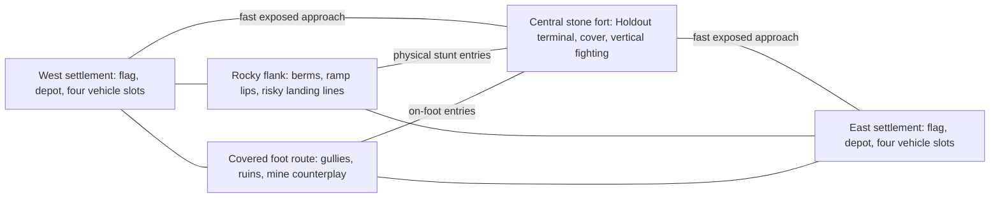

# Mobile Forces 2027 — offline character-driven game specification

Version **0.2, review draft**. Updated **2026-09-08**; source research checked September 7–8. Internal identifier `MobileForces2027`; public title undecided. This specifies future implementation. No Unreal build, native MCP connection, game benchmark, trained policy, or packaged game is claimed complete. A Fable **specification** review occurred on 2026-09-08 ([FABLE-REVIEW-RESULT.md](FABLE-REVIEW-RESULT.md)); no implementation review has occurred.

## 1. The game we are making

An original spiritual successor to Mobile Forces: responsive infantry combat, spectacular but physical arcade driving, dangerous passengers, powerful long grenade throws, destructible tires, laser traps, and objective battles around a desert stone fort. The defining opponents and teammates are **arcl1ght, hotlap, stitch3r, farsight, b0bbin, ramrod, lattice**. Their exact handles and supplied specialties are mandatory. A human should recognize the player behind the behavior even with names and voices hidden.

**Offline solo only: one human plus those seven bots, eight combatants, two teams of four.** Network play is removed from the product and engineering gates. Native **Apple Silicon Mac and Windows x64** are both required from the start. Four playable vehicle families are mandatory: Hummer-style utility vehicle, dune buggy, truck, and a new dirtbike. The dirtbike is an intentional addition to the original roster.

The favorite reference is **Western**, explicitly confirmed by the user: sandy desert, two settlements, a central rock/stone fort, and a fast vehicle race to the objective. Build a new map named **Fort Crossing**, asset identifier `FortCrossing`, using that spatial idea and original geometry/art. Ship **Holdout** as the primary mode and **Capture the Flag** as the second required mode.

The user values an arcade-like, exceptionally good physical driving feel. Human handling must be enjoyable before a bot driving controller is judged. A car following road waypoints, a cinematic jump, a homing grenade, or a normal bot with a memorable name does not satisfy this project.

**Authority:** latest user decisions > explicitly accepted review decisions recorded in `DECISIONS.md` > this specification. [BOT-CAST.md](BOT-CAST.md) expands identity; [DAY1-ENGINEERING.md](DAY1-ENGINEERING.md), [ACCEPTANCE.md](ACCEPTANCE.md), and [BUILD-RUNBOOK.md](BUILD-RUNBOOK.md) define mandatory engineering and evidence. Research explains choices and alternatives. Resolve contradictions explicitly; do not silently drop a hard requirement. Version 0.1 is preserved only in [the archive](archive/v0.1-network-plan/README.md); its multiplayer, Quarry Exchange, and Relay Breach scope is superseded.

## 2. Feasibility and selected approach

Highly convincing specialist bots are a credible target in this bounded game. Universal indistinguishability from humans in arbitrary full matches is not an established capability or a promise. Published imitation results demonstrate useful movement and tactical behaviors in restricted settings; the studies do not establish that an off-the-shelf plugin will produce this cast. See the limitations and primary evidence in [HUMANLIKE-BOTS.md](research/HUMANLIKE-BOTS.md).

Use a **hybrid controller**: fair perception and memory; persistent character preferences; objective/team coordination; practiced motor skills; bounded recovery. Start with authored/calibrated policies that expose the same aim, movement, throw and driving inputs as the human. Add demonstration learning or trained control only where it demonstrably improves held-out skill and believable behavior. Learning is an implementation option; excellent motor execution, fairness, and recognizable identities are required outcomes. A fallback that merely finishes a match cannot pass an expert's specialty gate.

Use **Unreal Engine 5.8.2 as the provisional pinned engine**, small C++ gameplay systems, Enhanced Input, data assets, restrained Blueprint/UMG presentation, and Chaos-based vehicle experiments. Qualify Epic's **native Experimental Unreal MCP** as editor assistance. Checked-in Python/C++ content recipes, UBT/UAT builds and actual game tests remain the reproducible path. No gameplay decision, bot tick, shipped feature, or voice playback requires an LLM, MCP, Python, network connection, or paid inference service. [Epic 5.8.2 announcement](https://forums.unrealengine.com/t/5-8-2-hotfix-released/2746335), [Epic Unreal MCP](https://dev.epicgames.com/documentation/unreal-engine/unreal-mcp-in-unreal-editor)

Astra implements and integrates. Fable independently challenges architecture, evidence and play quality when the user invokes it. Model labels describe the requested working roles, not verified public API model IDs. Confirm the tools/models actually available at kickoff. Do not silently substitute a model and claim Fable reviewed the work.

“One shot” means a **single sustained kickoff with resumable implementation, compile, experiment, playtest and repair loops**. It is not one model response or guaranteed unattended production of a polished game. Skilled motor behavior and game feel require empirical iteration and human judgment; permit progress on independent work while human evaluation is pending, but never convert pending evaluation into a pass.

## 3. Required complete scope

- One polished original desert fort map, plus developer test fixtures and held-out evaluation layouts.
- Holdout and CTF with complete match start, scoring, death, respawn, results and rematch.
- All seven named bots, with demonstrably distinct supplied play styles and working objectives, travel, combat, resupply and recovery.
- Pistol, portable machine gun, sniper, drop/charged-throw grenades with timed and impact modes, and planted laser mines.
- Four physically distinct vehicles, correct seating, passenger combat where supported, individual tire damage, continued degraded driving, disabling, abandonment, destruction and base replacement.
- First-person infantry and passengers; third-person chase camera for driver and bike seats with exposed FOV and lag settings (D-006); readable damage and objective feedback, controls, audio, settings and pause.
- Native Mac and Windows packages, repeatable generation/builds, evidence, a maintenance handoff, and human evaluation of handling and cast identity.

Not required: network services, matchmaking, dedicated servers, replication/prediction/lag compensation, split screen, accounts, cloud saves, open world, campaign, fully destructible architecture, exact asset/map reconstruction, real-person voice cloning, live conversational LLMs, Intel Mac support, Windows ARM support, production storefront release, public analytics, or a general autonomous-agent research platform. A later public release needs its own original-title, asset-license, signing and distribution work. Do not substitute that work for the requested game.

## 4. Reference evidence and original design boundary

The original manual documents charged grenade throws and secondary impact priming, planted laser beams, carrying limits, tire damage, vehicle seats and base returns. Contemporary firsthand previews describe playful suspension, powerslides, ramps and Western's central fort. Player comments specifically value enormous grenade throws, passenger play and accessible vehicle chaos. These are a purposeful qualitative sample, not a statistically representative survey. [Original manual](https://shared.akamai.steamstatic.com/store_item_assets/steam/apps/837940/manuals/Manual.pdf?t=1528450785), [GameSpot hands-on](https://www.gamespot.com/articles/hands-onmobile-forces/1100-2855996/), [PLAYER-EXPERIENCE.md](research/PLAYER-EXPERIENCE.md)

Numeric rules below are **new tuning seeds**, not recovered original constants. Preserve the user-described experience while measuring our own physics. Do not copy game binaries, maps, sounds, trademarks, or artwork into content recipes. Original graybox geometry and properly licensed assets are sufficient to establish feel; final visual/audio coherence remains a later mandatory presentation gate.

## 5. Player flow, teams and world lifetime

Boot -> menu -> Solo Match or Practice -> choose mode/team and kit -> loading -> 10-second warmup -> active match -> results -> rematch/menu. Practice allows human-operated skill fixtures and freely selected cast partners, and may show a Practice-only range/impact readout so long throws are learnable; it is not a replacement for full matches (D-015). Settings include resolution, scalable graphics, master/music/effects/voice, sensitivity, invert axes, rebinding, subtitles and explicit friendly-fire options. Save locally with versioned defaults and recovery from corrupt settings.

Default teams: human/hotlap/stitch3r/b0bbin versus arcl1ght/farsight/ramrod/lattice. This is a proposed balanced arrangement, not a claim about the historical players. Permit pre-match reassignment without duplication or omission. All seven must remain present in the standard match; no generic filler. Team balance should come from assignment and tested tactics, not invisible health/damage handicaps.

Use one local authoritative simulation. `GameMode` owns rules and spawns; `GameState`/player-state-like records may hold local match data without introducing networking. Game clock is monotonic simulation time. Pause stops movement, physics, fuses, mine arming, objectives, respawn and bot actions. Async work may finish internally while paused, but cannot apply state changes until resumed and validated. Restart/menu transition increments a world generation; every queued action, seat reference, policy job and objective operation checks that generation. Old work cannot mutate a new match.

Lifecycle phases: Loading, Warmup, Active, Finished, Returning. Warmup permits movement/practice but cannot award objective score. Enter Active creates a new gameplay generation: cancel held actions and queued jobs; clear projectiles, mines, transient effects, contacts and bot beliefs; reset all combatants to legal team spawns with fresh health/ammo; reset vehicles, seats and objectives exactly once. Preserve selected kits, roster, settings and static-map knowledge. A grenade released just before the transition cannot explode in the active match. Finish records immutable results, halts further scoring and damage, and offers rematch. No in-progress match persistence is required. A rematch constructs clean gameplay state while retaining only settings and explicitly allowed between-match statistics.

## 6. Infantry, loadout and weapons

Initial infantry health is 100, with no passive regeneration or armor system. Base run speed is 700 cm/s; sprint multiplier 1.2, crouch 0.55, aim-down-sights 0.65. Select one locomotion modifier by context rather than multiplying incompatible stance states. Carry burden multiplies the resulting speed by `clamp(1 - 0.02 * max(0, carriedKg - 8), 0.70, 1.0)`. An enemy flag adds 4 kg. These are tuning seeds and must be displayed honestly in the kit UI.

There are six equipment slots. Pistol costs one slot/2 kg, machine gun two/6 kg, sniper three/9 kg, bundle of four grenades one/2 kg, bundle of four mines one/3 kg. Maximum eight grenades and eight carried mines; no duplicate firearm. Carried bundle mass remains constant until all its charges are consumed, then frees mass but not the reserved kit slot until the next loadout selection; with two bundles of one type, charges deplete one bundle fully before the next (D-015). This intentionally simple rule avoids unspecified per-round weight. Kit changes apply only on respawn or in Practice. A legal default is MG, pistol, four grenades, four mines, using five slots; specialist presets may choose other valid combinations.

| Weapon | Magazine + reserve | Cadence | Initial damage | Other required behavior |
|---|---:|---:|---|---|
| Pistol | 12 + 48 | Up to 4 shots/s | 25 body; head ×1.5 | Semiautomatic, clear recoil/reload |
| Portable machine gun | 30 + 150 | 10 shots/s | 20 body; head ×1.5 | Consistent recoil that can be mastered, sustained tracking, burst control |
| Sniper | 5 + 20 | At least 1.4 s between shots | Charge 0–1 s raises body damage 67–110; head ×1.5 | Shared visible aiming laser, scope, charge cue, relocation counterplay |

Portable MG means a carried automatic weapon. Do not silently substitute the original's separate deployed heavy gun for stitch3r's and ramrod's requested play style. Pistol damage is full through 25 m, linear to 12 at 70 m, then 12 damage from 70 m through the inclusive 100 m hard maximum, and no hit beyond 100 m. MG is full through 60 m, linear to 12 at 150 m, then 12 damage from 150 m through the inclusive 250 m hard maximum, and no hit beyond 250 m. Sniper has no initial distance falloff and a 450 m hard range. Damage rounds once after modifiers using floor(value + 0.5). Set reload durations in shared data (initial pistol 1.4 s, MG 2.2 s, sniper 2.6 s); interrupted reload does not create ammunition. Hitscan weapons trace from the firing solution with muzzle obstruction verification. Crosshair visibility cannot permit firing through a wall that blocks the muzzle.

Head, body, vehicle chassis and tire are mutually classified hit results; a single bullet cannot automatically apply full damage to several overlapping hit zones. Apply the weapon's range/charge-adjusted body damage directly to a classified chassis or tire hit, without a head multiplier or hidden material resistance in the initial slice. A bullet stopped by intervening bodywork cannot also damage an occluded tire. Shots consume ammunition once. Fire cadence derives from simulation time; input repetition cannot accelerate it. Bodies use consistent collision rules and no bot-specific headshot immunity. Damage, hit feedback, death and ragdoll/cleanup must work from infantry and supported passenger seats.

A marked friendly base depot refills the selected kit's ammunition and consumables after two uninterrupted seconds on foot in its volume. Damage, firing, leaving, entering a vehicle or an objective interaction cancels it. It does not heal or repair vehicles. Reserve availability is unlimited for this slice, but travel, channel time and carried capacity are real. This sustains grenade/mine specialists without unlimited carried ammo. Bots perceive/use the same depot and carry limits.

Jump, crouch and bounded mantle enable readable infantry routes. No prone/slide skill tree is required. Fall damage: no damage at downward landing speed up to 10 m/s; linear from 0 to 100 between 10 and 22 m/s, capped at 100. Evaluate relative to contacted ground velocity, once per landing. Vehicle suspension absorbs ordinary landings through vehicle behavior; do not also apply infantry fall damage to still-seated occupants. This seed must be tuned with the physical vehicle and bailout fixtures.

## 7. Grenades: expert throws with extraordinary range

The human and arcl1ght use the same grenade. Hold primary to charge, release to throw; secondary toggles Timed/Impact before release; a separate rebindable Drop action places/releases it at close range. The HUD clearly shows fuse mode and charge. These bindings are a new usability choice, not an original-keyboard claim. No aim assist may silently steer a grenade after release.

The projectile is simulated by the engine's projectile movement component with swept collision and its bounce parameters, not a rigid body; changing this model requalifies every GRE case (D-010). Initial grenade collision radius is 5 cm, gravity magnitude 981 cm/s², and release speed scales from 6 to 45 m/s over 1.25 seconds of held charge. Use a documented monotonic charge curve, initially linear. Charge duration is computed on fixed-step simulation time from the input samples that carried the press and the release; both paths use the same specified input-edge-to-simulation-tick mapping and charge quantizer, and GRE-01 records the reachable charge levels and resulting range spacing per rendered frame rate (D-010). Inherit the thrower's world/platform velocity **once**, whether on foot or in a supported passenger seat; the reference is the world velocity of the release point (seat anchor for passengers), including the platform's rotational contribution (D-015). A hand-to-release sweep prevents spawning through walls. Use swept collision/substepping adequate for maximum velocity; verify low-frame-rate and moving-target contacts. Vehicles and projectiles advance on fixed 1/60 s simulation ticks independently of rendering, with catch-up behavior defined and silent loss of simulation time prohibited (recorded in `PROJECT-LOCK.json`), so that the same timestamped input script at 30/60/120 rendered FPS produces takeoff speed, jump distance and landing pose within declared tolerances (D-010). Air drag starts negligible so the public ballistic envelope is understandable.

Timed mode: fuse 3.5 seconds from release, restitution seed 0.35 and surface friction 0.4; it can bounce or explode in the air. Impact mode: detonate at the first eligible physical collision after release; maximum flight lifetime 12 seconds, then harmless expiry; a first collision at exactly the expiry instant is expiry, not detonation (D-015). Maximum-charge impact throws should demonstrate an approximately **180–220 m unobstructed envelope**, including repeatable hits beyond 150 m. A short timed fuse should not be quietly stretched to make those shots possible; use the mode that supports them. Terrain elevation and inherited motion alter actual range, and that is intended (D-007): with a 45 m/s throw added to the platform's horizontal velocity, a sprinting thrower reaches about 260 m and a buggy passenger at 30–34 m/s reaches roughly 420–450 m of equal-height unobstructed range at an optimized release elevation (about 56–57°, flight 7.6–7.7 s), neglecting drag; GRE-06 measures actual seat-height and rig-motion effects. GRE-06 records this envelope; map design and counterplay, not a cap, handle the balance.

Drop applies negligible intentional throw velocity while retaining platform velocity; it is not a sticky object or a delayed teleport. Every release, thrown or dropped, requires a projectile-volume-clear release point outside the thrower's and the release-time vehicle's collision hulls, reached through the validated hand-to-release sweep; otherwise apply the visible blocked-release policy: cancel without consuming the charge. Only the thrower and the release-time vehicle may be exempted during the hand-to-release sweep. World collision remains active; the final projectile volume must clear both source hulls, and all source exemptions end before flight. Subsequent contacts with either source, including a same-step rebound, are eligible normally. A dropped grenade that lands beside a stationary thrower and detonates is ordinary blast damage, not a proximity fuse. (D-002)

Explosion: 110 infantry damage through 1 m from the detonation point, linearly decreasing to zero at 5 m. Apply occlusion checks from a small outward contact offset to stable target sample points; the fraction of visible samples scales damage. The contact offset must not cross an intervening wall. Vehicle chassis maximum damage 180; individual exposed tires maximum 60 with the same radius curve. Mine casings and seated occupants are blast targets under the same occlusion rule: a casing reduced to zero is destroyed safely without its own explosion; an occupant is sampled from its seat pose, so an exposed buggy passenger takes blast damage while a truck cab occludes (D-011). Each target/subpart is evaluated once. Direct impact detonates the blast and does not add a second arbitrary kinetic damage packet. A nearby blast can kill or nearly kill without direct contact. **This is blast proximity, not an automatic proximity fuse.** Self-damage is on; explosive friendly fire follows the visible match setting.

arcl1ght learns/calibrates range, arc, charge, release, platform motion and observed target motion. Output ordinary view/charge/mode/release inputs. Static-map knowledge and practiced technique are allowed. Hidden target transforms, future human inputs, corrected projectiles, perfect runtime world rollouts and bot-exclusive impulse are forbidden. Separate motor placement accuracy from uncertainty in predicting what a person does next. An accurate throw can miss because the person makes a late unexpected dodge; do not manufacture misses by crippling expert motor skill.

## 8. Laser mines and lattice

A planted mine is a physical casing and a visible team-colored beam to the first opposing static surface. Initial placement: on foot, within 1.5 m, continuous 0.8-second placement action, valid static surface and beam length 0.3–12 m. Consume ammunition only after validated placement; arming takes 1.5 seconds. Preview shows the actual intended beam. Invalid/no opposing endpoint placement gives useful feedback, never an invisible active trigger. The completed beam's rendered and collision endpoints must agree.

Retain the qualified static endpoint, but a later opaque dynamic blocker clips the currently exposed beam. Update both rendered and trigger segments together; the occluded remainder cannot trigger someone behind it. Evaluate swept contacts in temporal order and nearest exposed contact order: a qualifying enemy contacting the beam triggers it; a nontriggering opaque friendly blocker truncates it. Removing that blocker restores the visible segment toward the stored endpoint. A qualifying actor already intersecting the exposed beam when arming completes triggers once at arming; repeated callbacks cannot create extra explosions. Include this behavior in the beam fixture rather than relying on a rendered line alone.

Detect actual swept crossings of the beam by enemy combatants and vehicles, including fast motion between frames. Initial default is enemies-trigger-only; an explicitly labeled Classic Traps setting enables indiscriminate triggering, including the planter. Blast friendly fire is separately visible and defaults off. Beam/casing persistence after planter death is intentional; team and planter attribution remain stable. No proximity radius may replace the beam intersection test.

Limits: 16 active/pending mines per planter, 32 per team, 64 total. Reservation counts include arming mines to prevent same-frame overflow. At a limit, refuse a new placement with feedback; do not silently remove the oldest trap. Destroying/disarming a mine frees its slot. No automatic kill farming via invulnerable spawn pads: placement within a 10 m protected base spawn/depot volume is refused for both sides; entrances outside it remain tactically relevant.

Explosion has 120 infantry damage within 1 m, linearly falling to zero at 4 m; chassis maximum 250 and exposed tires maximum 80. Use the grenade's documented occlusion/unique-target approach. Casing has 20 health. Shooting it, or grenade/mine blast damage, destroys the device safely with readable effects; initial implementation has no mine-to-mine explosion chain and a destroyed casing never detonates (D-011). An ally can remove its team's mine through a 1-second close interaction, without recovering ammo. Enemies can shoot a discovered trap. Moving-vehicle attachment and thrown proximity-mine mode are later reference-inspired options, not substitutes for the required planted beam system.

lattice places many legal traps, varies height/angle/path combinations, covers approaches, replenishes supplies and relocates after observed adaptation. He cannot know an unseen opponent's exact future path. Detection and avoidance are possible; a mine specialist who gets useful area denial without a kill is behaving successfully. Mines must remain understandable in sunlit sand, shadows and lower graphics settings without being giant glowing billboards. Evaluate his path planning around friendly traps under both trigger presets.

## 9. Four vehicles and the handling contract

Human fun is a first-class gate: responsive launch, momentum that can be felt, readable grip loss, satisfying suspension travel, controllable powerslides/180s, rough-ground lines, recoverable impacts and landings. Ordinary wall brushes and intentional ramp landings do not cost chassis health in the initial arcade preset. Do not conceal a heavy simulation behind “realistic physics” while failing the user's desired feel. Vehicle fire and explosive destruction still matter.

| Family | Physical wheels / seats | Initial top-speed band | Initial acceleration target | Chassis health |
|---|---:|---:|---|---:|
| Dune buggy | 4 / 2 | 30–34 m/s | 0–25 m/s in 3.5–5 s | 450 |
| Hummer-style utility | 4 / 4 | 25–29 m/s | 0–22 m/s in 5–7 s | 800 |
| Truck | 6 / 5 | 19–23 m/s | 0–18 m/s in 7–10 s | 1000 |
| Dirtbike | 2 / 1 | 32–37 m/s | 0–25 m/s in 3–4.5 s | 250 |

These are proposed tuning ranges, not guaranteed final values. Give each rig its own mass, center of mass, suspension travel/damping, tire response, steering curve, gearing, braking, camera and collision geometry. Log those values in versioned handling data. The truck's six real wheels cannot be a four-wheel chassis with decorative extra tires. The bike must support actual two-wheel contact and leaning/balance behavior; it cannot pass as a four-wheel car under an invisible bike mesh. An empty or stationary bike is held upright by the documented balance assist (kickstand behavior); a bike on its side may be mounted from within 2.5 m at vehicle speed ≤ 4 m/s under the shared entry rule, and mounting additionally requires a collision-free swept righting path and upright pose, otherwise entry fails without moving the bike; the overturned-vehicle recovery action does not apply to bikes (D-012).

Speed-sensitive steering, bounded traction aids, anti-roll behavior and bike balance assistance are permitted if documented and identical for human and bot. **Airborne pitch/roll inputs are included (D-004):** a small documented torque available while no wheel has ground contact, exposed to the human on the same bindings as bots, with its magnitude, rate limits and per-rig values recorded in the versioned handling data; it cannot grant arbitrary flight, lift, or yaw control, and the human handling course qualifies it before any bot uses it. A bot may choose brilliant inputs but not change mass, gravity, suspension, grip, collision or engine power. Qualify balance/handling in physical fixtures before committing to a particular Chaos component combination; a project-owned movement extension is allowed if the same contract and performance pass.

### Tire damage is physical

Each tire has 40 health and states Intact, Damaged below half, Failed at zero. Damage changes the affected wheel's grip/cornering/braking and drag; initial failed longitudinal/lateral grip is 20–30% of intact, then tune. Visual puncture, wobble and HUD state must correspond to the physical wheel. Unequal front/rear/left/right failures should produce understandable different steering/traction effects. Test on a slope and during a turn, not only by reading a variable.

Enough tire failures disable **powered propulsion**: three of four for buggy/utility; four of six for truck; two of two for bike. Remaining momentum, slope motion and physical impacts may still move a disabled vehicle. Do not freeze its world transform. Before that threshold it can limp, struggle or become tactically impractical. Steering input can still operate where physically applicable. Bots assess observed loss of mobility and may abort a jump, reduce speed, pick a gentler route, bail or abandon. No omniscient tire repair, invisible grip compensation or special bot-only immunity.

Bullets classify a tire hit separately from a chassis hit. Explosions may affect exposed tires and chassis once each, since these are explicit separate subparts. Fuel-cap destruction is not a required addition. Vehicle repairs are not in this slice: abandonment, destruction and fresh base replacement provide recovery.

### Seats, entry and lifecycle

Each base has one slot for each family: eight vehicles can exist across the map, plus bounded destruction effects. Empty vehicles sleep when physically settled, but performance must also pass with all eight awake. Empty vehicles are usable by either team. An occupied vehicle's team follows its occupants; enemy entry into an occupied vehicle is refused, and teammates can take an available seat. The first entrant becomes driver by default; explicit seat selection is available.

Keep three vehicle identities separate. Original base-slot ownership controls replacement/proximity-return rules and never changes. Current combat affiliation is the occupants' team, or, while empty, the last driver's team; a never-driven vehicle uses its original slot team. Show that affiliation through the ordinary team marker so it is observable, while empty-vehicle boarding remains open to either side. Use combat affiliation for enemies-only mine triggers and friendly ramming policy. Ramming kill credit uses the last driver's stable player ID, even after a bailout/death; without a prior driver it is environmental damage. A new driver updates affiliation/credit, while a fresh replacement clears prior-driver history. Thus an empty rolling enemy-affiliated vehicle can trigger a beam and cause credited damage without an invisible occupant.

Entry requires a clear valid anchor within 2.5 m and vehicle speed no greater than 4 m/s. Seat reservation is atomic within the local simulation. Occupants have a persistent player identity, shared inventory/health and a single active controlled body/collision representation. Driver controls suppress personal weapons. Supported passenger anchors may use their legal weapons/grenades with muzzle/release obstruction and a constrained view arc that cannot fire through the cabin. Mine placement remains on foot. Define each seat's visibility and passenger firing arc in the rig asset; the exposed buggy passenger must support meaningful combat. Bike has no passenger seat, and its rider has no weapons while mounted: the bike is a fast, exposed traversal vehicle by design (D-016).

Ordinary exit at at most 4 m/s sweeps candidate positions, requires walkable landing clearance and keeps the seat occupied if all exits are blocked. High-speed bail is a distinct 0.4-second held action; it chooses a swept clear ejection point, inherits velocity and uses shared landing damage. If no safe clearance exists, report blockage instead of teleporting through geometry. A human passenger's stop/dismount request causes a bot driver to seek a feasible stopping place promptly, with acknowledgment; danger may change the stopping location, not indefinitely suppress the request.

An overturned stationary vehicle may use an explicit shared recovery action after five seconds nearly stationary: hold three seconds, validate a collision-free upright pose, then recover in place and drop any carried flag to a valid nearby ground point. This visible arcade recovery is available equally to humans/bots, logged, and excluded from stunt-success credit. It cannot occur in flight or overlap others, and it does not apply to the bike, which is righted by mounting (D-012). Destruction kills still-seated occupants, releases their objectives once, creates a nonblocking wreck for eight seconds and schedules replacement at the original base slot after 20 seconds. Exiting before destruction uses normal bailout rules.

An empty intact vehicle returns after 35 continuous seconds without occupants and without an enemy of its original spawning team within 20 m; a disabled empty vehicle uses 15 seconds. Occupancy or that enemy proximity resets the empty-return timer. This is the documented slice rule, not a recovered original timeout. An eligible return removes the old instance and creates a fresh one only through its original slot. An occupied spawn pad delays replacement with a two-second retry; after ten consecutive blocked retries the replacement uses the next validated alternate anchor within the base, so a parked vehicle cannot starve a family indefinitely; never spawn inside another actor or spawn duplicates (D-014). At most one live/return-pending replacement per base slot. New vehicles have restored wheels/chassis, correct seats and no old occupants/objective references. Specify one slot-generation counter so delayed destroy/return events cannot duplicate a newer replacement. Destruction uses its separate 20-second replacement timer; enemy proximity away from the spawn pad does not postpone that replacement.

## 10. Fort Crossing

Initial graybox bounds are approximately 640 × 420 m; bases around x = −270 m and +270 m; central fort roughly 90 × 70 m with playable elevations around 5–12 m. Use a local coordinate/layout recipe so changes can regenerate reproducibly. These numbers are layout seeds, not Western measurements.

This is a topology diagram, not a measured reconstruction or final terrain plan. CTF connects the opposing settlements through and around the fort; Holdout pulls those same routes toward its center.

The visual structure must read instantly: distant opposing settlements, exposed desert travel, rocky approaches and a central stone enclosure/fort. Provide at least four meaningful approaches: fast open vehicle line, rough flank with usable rock lips, covered infantry approach, and an elevated/indirect approach. Multiple human-reproducible ramps and berms allow unexpected fort entries; a road spline alone is insufficient. Fort interior cover, entrances and roof/ledge access support MG pressure, sniper angles, grenade arcs and mines with counterplay. Avoid an unanswerable sniper view over both spawn interiors.

Initial arrival targets: approximately 12–20 seconds for a purposeful first vehicle run and 25–45 seconds on foot, measured from legal active-match starts. Equivalent baseline routes from the two bases should be within 10% before asymmetrical advanced lines are introduced. The point/flag interaction requires dismounting, but physically landing a vehicle inside the fort is allowed. Do not put invisible anti-stunt barriers around the very places that make hotlap interesting.

Place original buildings, rocks and landmarks to support route memory. Include sufficient cover for foot combat without turning the desert into a generic corridor shooter. Use visible kill/return boundaries only outside playable terrain; accidental holes inside the intended map fail. Explicit recovery volumes prevent permanently lost flags/vehicles without granting bots traversal shortcuts.

Developer fixtures are separate: weapon range with multiple heights and surfaces; tire/suspension/skidpad/ramp course; mine beam sweep course; objective/seat/lifecycle fixtures; and three evaluation terrain layouts held out from motor tuning. Shipping one polished arena does not forbid these test maps, and test-map success does not prove Fort Crossing is fun.

## 11. Modes and shared combat rules

### Holdout — primary

A single terminal in the central fort begins neutral. A living on-foot player within 1.5 m with line of sight holds Interact continuously for one second to claim it. Line of sight for every objective interaction is an unobstructed trace from the player's eye point to the objective anchor; walls and vehicles block it, pawns and mines do not (D-013). Enemy presence alone does not stop a claim; damage, movement out of range, lost sight, death, seat entry or releasing input interrupts. At each simulation timestamp, process interruptions before claim completions; resolve surviving simultaneous completions by stable player-ID tie-break. Ownership persists until another team completes a claim.

Award one score point per second of simulation time owned, accumulated as owned simulation time with fractional-millisecond carry per team, never rounding individual physics steps or ownership intervals; thresholds and exact equality compare totals as integer milliseconds using floor, so sixty owned 60 Hz ticks yield exactly 1,000 ms (D-013). First team to 240 owned seconds wins; otherwise after 12 minutes the higher total wins, exact equality draws. No hidden overtime. Process captures, score thresholds and expiry in chronological simulation order across a long frame; the winner cannot depend on a UI timer rounding. The team owns the fort through persistent control, not by standing continuously in a generic circular capture zone. HUD shows owner, both totals, timer and contest/interaction feedback.

### Capture the Flag

Each base has one flag. All flag interactions require a living on-foot player within 1.5 m of the flag/stand anchor, continuous line of sight, and held Interact. Enemy pickup takes 0.3 seconds; one carrier per flag. A friendly dropped-flag return takes one continuous second. Capture takes 0.3 seconds at the carrier's own stand while its own flag remains Home throughout the hold. Flag mass adds 4 kg; carriers may ride/drive and remain visibly marked to actual observers. Public objective state, shown on every HUD and available to bot coordinators, is exactly: Holdout owner and both totals, the match timer, and each flag's Home/Carried/Dropped state. Dropped-flag location, carrier identity and carrier position are not public; they must be observed (D-008). A delivered enemy flag resets to its base and increments score once without resetting the match or unrelated vehicles/mines. Pickup and return interactions cannot target a Carried flag; a carrier may capture normally at its own stand. Flags cannot transfer directly between carriers without a legal drop and pickup.

First to three captures wins; otherwise the higher score after 12 minutes wins and exact equality draws. No overtime. Death, explicit Drop, vehicle destruction or invalid carrier lifecycle drops the flag once at a swept valid ground point; outside-world/inaccessible drops reset home immediately with clear feedback. A dropped flag returns after 20 seconds. Any continuous same-team possession chain has a 90-second lease from initial theft; dropping/re-picking by that team does not renew it. On lease expiry return Home; a Home reset begins a new theft opportunity. This prevents indefinite vehicle keep-away while allowing real transport tactics. **CTF is designed around vehicle transport.** The shipped route must make the fastest legal all-foot capture take at least 90 s, while a vehicle-assisted capture, including reaching and boarding the vehicle, dismount and the capture hold, completes strictly before expiry; UX-06 measures both. For orientation, with the default kit plus flag a straight-line sprint between stands takes about 78 s and a run about 94 s. Pickup, reaching a vehicle, and final delivery are on-foot segments. (D-001)

Flag interactions cancel on damage, losing range/sight, entering a seat, death or release. Simultaneous returns/pickups/captures use ordered timestamps with stable tie-breaks. A return completed earlier in a frame may permit a later same-frame capture; a later return cannot retroactively permit one. Record transitions as events so tests can verify conservation: every flag is exactly Home, Carried or Dropped, never duplicated.

### Shared rules

Resolve same-time events explicitly. First integrate continuous Holdout ownership score up to the event timestamp; a score threshold reached no later than the regulation deadline finishes the match. Then process regulation expiry, then death/destruction/world-bound invalidation and flag lease/auto-return expiry, then damage and other interaction-invalidating events, then interaction completions, with stable player-ID tie-breaks between otherwise simultaneous valid interactions. An interaction must finish strictly before the regulation deadline to count. A flag capture/pickup at exactly its possession-lease expiry loses to that expiry. Process each event against the state left by earlier events and cancel invalidated work. This priority is a new slice rule; test boundary timestamps and oversize frames explicitly.

Respawn delay is five seconds. Select a valid team spawn with clearance; if blocked, choose another validated anchor, otherwise wait and report. Spawn protection lasts two seconds and ends immediately on firing, entering a vehicle, interacting with an objective, or leaving a 5 m spawn volume. It must be visibly indicated. Protected players cannot trigger traps or deal damage until they perform an action that ends protection; protection restricts only the respawned body, so devices the player planted in an earlier life keep their attribution and effect (D-013).

Standard preset disables friendly bullets, friendly ramming and friendly explosive damage to combatants and occupied friendly vehicles; self-explosive damage remains enabled. **An empty vehicle and its tires remain damageable by either team**, including its last driver, so the human can abandon a crippled vehicle and blow it up to start replacement. No player kill/score is awarded merely for destroying an empty vehicle. Vehicle destruction has visible/audio explosion feedback but adds no second area-damage blast in the initial slice; still-seated occupants die through the explicit destruction rule. The match setup exposes Classic Traps and explosive friendly fire separately. AI must use the actual chosen rules. Ramming damage begins at relative impact speed 5 m/s and scales linearly to lethal 100 at 15 m/s, capped at 100; apply once per distinct contact/crossing with a per-target contact latch until separated, not once per overlap tick. Stationary vehicle overlap cannot become a damage blender. Ramming damage applies to the struck infantry or the struck vehicle's chassis; the ramming vehicle takes none, occupants of a struck vehicle take none directly and die only through destruction, wall and terrain crashes cost no chassis health in the arcade preset, and infantry take no horizontal-impact damage beyond the shared landing rule, so a bail-out costs nothing beyond its landing (D-014). Each player death scores once, clears interactions, drops flags, releases seats and schedules exactly one respawn. Team score derives from objectives; kills appear separately on the scoreboard.

## 12. Bot cognition, motor skills and evaluation

[BOT-CAST.md](BOT-CAST.md) is the detailed identity contract. Required core: arcl1ght expert grenade thrower; hotlap highly skilled reckless stunt driver; stitch3r MG specialist; farsight sniper and driver; b0bbin weakest overall with occasional earned surprises and Russian-accented jokes; ramrod forceful driver/MG attacker; lattice prolific laser-mine trapper. Proposed extra habits are interpretations, not facts about the historical people.

Use a common action interface for human/bot input: locomotion, stance, view rates, trigger, reload, charge/release/drop, mode selection, interaction, seat request, steering/throttle/brake/handbrake, permitted air/balance inputs, bailout, and visible recovery. Reject invalid simultaneous actions through shared state machines. Bots cannot call damage, teleport, objective capture or possession shortcuts directly.

Perception produces time-stamped observations of visible actors, audible events and legally communicated teammate information. Static map geography may be known like a practiced human's map knowledge. Dynamic blockers/vehicles/traps/enemies require observation; absence cannot be inferred from a hidden actor array. Keep last-known records with age/uncertainty, not live actor references that update under cover. Teammate reports have a proposed 0.25–0.8 s delay and retain the reporter's information quality. Performance caches must preserve the same access boundary.

All decision-side queries, including EQS tests, release/clearance/feasibility checks, forecasts and their caches, obey the observation boundary: they evaluate static geometry plus observation-derived proxies computed from frozen belief state, including recorded position, age and uncertainty, without refreshing them from unobserved world state; a stale proxy stays at its believed position or follows a deterministic belief-based prediction. They never touch the live set of unobserved dynamic actors. Perception senses the real world through legal sight/hearing/damage channels; physical actions resolve against real collision, so bumping into an unseen enemy is legitimate while a speculative clearance result revealing one is a leak. The decision step must be repeatable in a fixture: with all decision-affecting state reset, including beliefs, random streams, clock, pending queries, caches, commitments and coordinator state, and with legal observations and public match state held fixed, it produces identical intents. (D-003)

An objective coordinator allocates requests from team knowledge and public match state. It can prevent all four camping one lane without issuing commands from unseen exact enemy locations. Flag-carry plans include a vehicle leg; on-foot segments cover pickup, reaching a vehicle and final delivery (D-001). Individual utility arbitration balances objective value, specialty opportunities, travel, ammo, perceived threats and commitments. Use hysteresis to avoid indecisive thrashing. b0bbin can misunderstand or overcommit, but must still complete ordinary interactions and recover from mechanical blockage. Give him occasional sound plays produced by the same legal rules; do not rig a win, move a victim into his bullet or secretly grant damage.

Motor execution operates at an appropriate fixed/update rate with interpolated commands; suggested perception 10 Hz, high-level utility 2–5 Hz, close movement/driving 30–60 Hz. These are adjustable scheduling seeds, not guarantees. Audit allocations and frame spikes. Async planners/policies consume immutable observation snapshots, carry world/profile/model generation IDs and expire stale results. No UObject mutation off the game thread. Paused/destroyed/restarted worlds cannot receive pending action outputs.

Correlated attention, believable view acceleration, commitment and skill-specific error are preferred to white-noise aim jitter. Experts can be very accurate when prepared. Fairness requires plausible information and legal controls, not artificially equal kill/death ratios. Enforce observed-information counterfactual probes with same-run visible positive controls: changing a wholly unobserved target must not alter a bot's observation/action distribution until a legal cue exists. Do not compare naturally divergent long world simulations and pretend any divergence proves cheating.

### Optional demonstration/learning track

Instrument recording before collecting data: build/physics/map/profile IDs, action and filtered observation schemas, state hashes, demonstration source/consent/provenance, timestamps and outcome labels. Privileged full state may be retained in a separate evaluator channel for diagnosis; it is inaccessible to runtime policies and never silently becomes a training input that is absent from fair runtime observation.

Split by session, player and layout **before training**, not adjacent frames from the same recording. Keep development, validation and acceptance manifests distinct. Freeze motor/profile revisions before collecting held-out evaluations. Using an acceptance failure to tune reopens that holdout; create a fresh test set rather than reporting the retuned set as untouched. Learned policies are immutable during accepted matches; limited working-memory adaptation to observed opponents is allowed and reset rules are explicit. No uncontrolled online self-training.

Qualify training host separately from inference on both native targets. Unreal Learning Agents and NNE capabilities do not prove a selected model/operator/runtime will execute in both delivered packages. Use a compact CPU-compatible policy only after measured native inference passes; no CUDA dependency in the common runtime. If the model is unavailable, the authored controller can keep a test game functioning, but the model-dependent skill gate remains incomplete until the replacement independently meets it. [BOT-MOTOR-SKILLS.md](research/BOT-MOTOR-SKILLS.md), [ENGINE-ARCHITECTURE.md](research/ENGINE-ARCHITECTURE.md)

### Human evaluation

Measure basic legality, objective participation, specialty competence and recovery automatically, then evaluate believable full-match behavior with human participants. Hide names, cosmetics and voice for recognition trials. Compare same-weapon stitch3r/ramrod and the three driver identities under comparable opportunities so recognition cannot be reduced to equipment. Use complete/randomly selected sequences and full sessions, not only promotional highlights. Compare human demonstrations in the same game, including mistakes and recovery. Publish sample sizes, uncertainty, exclusions and inconclusive outcomes. Neither a pleasant voice nor one impressive grenade clip proves a humanlike opponent.

## 13. Runtime architecture and content contracts

Start with one game module and small test/editor tooling modules. Proposed classes/components: local match rules/state; player and bot controllers; infantry character; common input-intent adapter; weapon/equipment state; health and hit classification; grenade actor; laser-mine actor; vehicle pawn with seat/tire/lifecycle components; base vehicle slot; objective actors; fair observation/belief memory; utility/skill arbitration; motor policy adapter; telemetry/recording subsystem; local settings/save schema. Names are implementation guidance, not an existing API claim.

Represent kit, weapon, grenade, mine, vehicle, bot profile and mode tuning in typed/versioned data assets with validation. Every exact bot ID resolves to one profile and its expected loadout/skills. Startup/content validation rejects missing meshes/collision, impossible wheel/seat rigs, missing behavior policies, invalid mine endpoints, absent spawn/flag/terminal anchors, and empty cooked maps. It must not silently replace seven missing characters with generic defaults and report success.

Use stable semantic IDs independent of generated asset timestamps. Separate generated and hand-authored asset ownership; regenerating must preserve unrelated authored changes. Pin recipe inputs, generator source, imported-asset provenance and resulting semantic reports. Binary asset hashes document actual artifacts, but unstable binary serialization alone is not a substitute for a semantic idempotence check. Keep source and accepted content manifests together.

Use conventional navmesh plus local avoidance for infantry; vehicles need traversability/terrain affordances and maneuver controls beyond a road graph. Navigation adapters respect the same actual collision, wheel damage and legal recovery. A complete cast needs functional on-foot behavior too: a specialist cannot stand idle simply because no favorite vehicle is present.

## 14. Presentation, controls and voice

HUD: health, current equipment/ammo, grenade mode/charge, mine remaining/cap feedback, objective state/time, flag status, team cues, vehicle speed/seat/tire diagram, interaction and blocked-action reasons. Names and scoreboard preserve exact spellings. Controls distinguish on-foot, passenger, driver and bike contexts and avoid grenade/drop/exit conflicts. Mouse/keyboard is mandatory on both OSs; controller support is later unless added without delaying the required quality gates.

Make muzzle flashes, impact sounds, grenade trails/cues and explosions readable while preserving visibility. The sniper laser and mine beam remain observable under the shared minimum graphics preset. Vehicle tire state has physical, visual and audible feedback. Driver and bike seats use a third-person chase camera; infantry and passenger seats are first-person (D-006). Cameras must handle fort walls, jumps, bike lean, passenger aim and fast exit without clipping into opaque meshes or inducing extreme shake; include FOV, camera-lag, shake and motion-blur controls.

Use original or properly licensed audio. b0bbin's **Russian-accented voice and contextual jokes are required in the completed presentation gate**; temporary subtitles are allowed during graybox but do not satisfy that requirement. Do not equate ethnicity with his low skill; those are independent user-specified traits. The lines are recorded by the owner or a consenting friend performing the accent, with written consent and provenance recorded per line bank (D-009); the performer must not be the real person being evoked unless that person agrees. Do not clone a real person's voice. Other cast chatter should support identity without drowning out combat. Keep subtitle text and event selection local, with per-speaker/global cooldowns and a voice mute setting.

## 15. Mandatory day-one agentic engineering

Adapt the useful practices inspected in the private reference project, not its runtime product. [DAY1-ENGINEERING.md](DAY1-ENGINEERING.md) specifies the full contract and source traceability. Required from the first implementation gate: concise agent instructions/state; exact engine/tool/source/content/model manifests; named test registry and evidence classes; failure-honest process supervision; one exclusive editor mutation lease; semantic recipes; interruption/recovery seams; broad-on-unknown change impact; actionable residuals; separate development/validation/acceptance data; independent review dispositions.

All ENG-001 through ENG-016 are mandatory obligations. Some establish infrastructure at M0; those requiring later game content mature with their owning milestones. A not-yet-applicable future-content check is pending, not a green M0 claim. Nonzero child exit, timeout, missing report, zero executed tests, filtered wrong tests, stale report and native-host absence cannot become PASS because a log says success. Pass/fail data derives from actual run identity and expected registry membership.

Keep evidence classes distinct: source/static, harness/hermetic, engine functional, native package, rendered runtime/performance, and human evaluation. Fixed-tick physics (D-010) does not by itself guarantee frame-rate or platform independence; both are measured, and seeded physics is not guaranteed bit-identical across CPUs/OSs; compare bounded invariants/statistical envelopes and record engine/hardware. Do not substitute headless screenshots, empty test suites or Linux results for native rendered Mac/Windows evidence.

The native MCP plugin contains runtime modules. Explicitly exclude its modules/plugin and any editor bridge from delivered packages; absence of an active listener alone is insufficient. Check dependency/cook/module receipts and runtime sockets. Editor automation remains loopback-only, serialized, operation-identified and recoverable. A client timeout is not proof an editor mutation stopped; hold the lease through actual completion and verify postconditions before retry.

Do not import the reference project's operational hosts, credentials, deployment hooks, runtime dependencies, giant residual history, or a stop-after-one-package convention. That project was a read-only reference. Continue authorized implementation through coherent gates, maintaining checkpoints and clear outstanding obligations.

## 16. Native platform, setup and performance targets

Start with matching installed UE5.8.2 distributions on Mac and Windows; a source-built dedicated server is unnecessary. Recheck latest stable patch at implementation kickoff, then pin the chosen engine's full build identity and requalify any upgrade explicitly. Mac first is viable enough to retain as a hard requirement, but Chaos behavior, bike balance, chosen learning runtime, editor tooling and actual rendering must be exercised there early.

Epic's current Mac table specifies UE5.8 minimum macOS14.5/Xcode26.0 and recommended Xcode26.1.1, and flags Xcode26.4 incompatibility. The 5.8.2 hotfix known issue UE-377426 specifically reports compilation failure with **Xcode26.4 or newer** and recommends a version before26.4; start with the recommended26.1 family and qualify the actual installed toolchain. [Epic known issue](https://forums.unrealengine.com/t/5-8-2-hotfix-released/2746335) Windows table currently lists VS2022 17.14+ or VS2026 18.0+ for UE5.8. Check the pinned engine documentation and installed SDK reports. [Epic Mac requirements](https://dev.epicgames.com/documentation/en-us/unreal-engine/macos-development-requirements-for-unreal-engine), [Epic Windows requirements](https://dev.epicgames.com/documentation/en-us/unreal-engine/setting-up-visual-studio-development-environment-for-cplusplus-projects-in-unreal-engine)

The September7 workstation inspection found an Apple Silicon M-series laptop with 24GB memory, limited available workspace storage, command-line tools but no full Xcode or detected Unreal installation in standard locations. These are dated observations, not current blockers proven afresh. Before installation recheck hardware, free space, full Xcode, SDK, launcher/engine locations and Windows host access. Budget roughly150GiB free as a planning allowance for engine, project, caches and packages, then measure actual requirements; do not represent this allowance as an Epic minimum. Existing user files must not be deleted to free space without separate authorization.

Define and record actual target machines; initial planning references are this M-series/24GB Mac and a Windows x64 six-core CPU/16GB RAM/discrete GPU around RTX3060-class. Hardware is a provisional target, not an observed benchmark. Shared acceptance preset: 1920×1080 output, medium scalable lighting/materials, no required hardware ray tracing or platform-exclusive effect. Visible mine/sniper cues and collision/gameplay must remain identical across quality settings.

Performance scene: one human, all seven bots, the eight vehicle slots populated, all eight vehicles awake in an explicit stress fixture, and a 64-active-mine cap fixture with explosions/motion. After60s warmup, record10minutes of rendered play per native platform: target median frame time ≤16.7ms, p95≤22.2ms, p99≤33.3ms; combined bot CPU time including policy inference p95≤3ms. Record resolution/upscaling and GPU/CPU timing separately. Initial resident-memory target≤7GiB; after three successive matches and cleanup, settled resident growth≤10% from the first settled match. These are unmeasured targets. Profile/tune without reducing the required cast, vehicle catalog or fair physics.

## 17. Delivery order and completion

M0 establishes the day-one harness, exact native environments and minimal packaged/rendered boot on both OSs. M1 establishes shared human controls, firearms/grenades, one reference buggy with tire/lifecycle behavior, and the handling fixtures. M2 proves arcl1ght's throw execution and hotlap's discovery/control potential against human-reproducible fixtures. M3 implements all remaining character skill dependencies, including sniper/mine mechanics, and validates the complete cast individually. M4 integrates all four vehicle rigs, Fort Crossing, Holdout/CTF, seats, objective coordination and complete matches. M5 improves motor policies as needed and conducts frozen held-out/full-session evaluations. M6 completes presentation, required voice, native packaging and performance. M7 resolves independent review and delivers a verified handoff. Dependencies are expanded in [BUILD-RUNBOOK.md](BUILD-RUNBOOK.md).

Prototype all vehicle families early enough to expose the dirtbike/truck risk; final rig completeness is M4. M2 skill evidence is provisional if later physics changes; affected tests must rerun after the handling revision. Mine mechanics exist before lattice is assessed; M4 is integration, not first creation of his weapon. Both platforms remain in each meaningful gate. Do not build an entire Windows game and discover Mac incompatibility at the end.

A credible schedule is iterative, potentially multi-month even with strong agents, especially for convincing stunt generalization and human evaluation. No date or dollar estimate is warranted before M0/M1 measurements. A coherent graybox should come far earlier than final humanlike polish, and should remain runnable while skill work improves.

Complete means the required content exists, the exact final artifacts pass applicable automated/native/rendered checks, the human handling and identity evaluations are documented, and no mandatory obligation is silently deferred. If a real external blocker prevents completion, leave a resumable state and identify the precise missing evidence. [ACCEPTANCE.md](ACCEPTANCE.md) defines the checks, [BUILD-RUNBOOK.md](BUILD-RUNBOOK.md) provides the kickoff, and [FABLE-REVIEW.md](FABLE-REVIEW.md) prepares the independent review.
