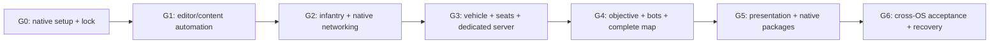

# Implementation runbook: one kickoff, staged evidence

Status: proposed execution contract; no commands in this document have built a game in this workspace. Read [SPEC.md](SPEC.md), then the relevant research appendix. All future filenames and tool names below describe deliverables to implement, not files/tools already installed.

## 1. What the implementer is being asked to finish

Deliver the V0.1 vertical slice in the specification: original combined-arms gameplay, native Mac and Windows packages, 4v4 humans/bots, Relay Breach, one transport with working driver/passenger roles, one map, persistent settings, and reproducible evidence. Carry the run through the gates without repeatedly asking permission for routine implementation choices. Infrastructure access, unapproved costs, missing assets, or impossible tests must be reported honestly while independent work continues.

This document is not authorization to begin implementation during the research turn. The user will review this specification with Fable before issuing an implementation instruction. There are no automatic installs, purchases, repository publication, or machine modifications hidden in this package.

## 2. Durable control files

At implementation start, create these project-authored files:

```text
PROJECT-LOCK.json                  exact engine/build/toolchain/content identity
IMPLEMENTATION-STATE.md            gate, work owners, next action, blockers
DECISIONS.md                       accepted deviations and their evidence
ContentRecipe/                     versioned source for generated content
ContentRecipe/assets.json           stable asset IDs and selected dependencies
ContentRecipe/quarry_exchange.json  map transforms, routes, spawns and cover tags
Scripts/doctor.py                   read-only prerequisite and lock validation
Scripts/build.py                    native UBT/UAT wrapper; exact commands logged
Scripts/generate_content.py         editor Python entry, not standalone Python runtime
Scripts/validate_content.py         editor-native asset/reference validation
Scripts/run_scenarios.py            process management and scenario report collection
Scripts/collect_evidence.py         checksums, report index, log/artifact references
Build/AgentTools/                   editor-only custom tools if genuinely needed
Saved/Verification/<run-id>/        local output; not source-controlled wholesale
docs/evidence/<gate-id>.md          compact reviewed results with artifact pointers
```

`PROJECT-LOCK.json` must record schema version, Unreal version/build changelist/source commit, installed/source build provenance, compiler and SDK versions per host, host OS/architecture, template provenance, enabled plugin versions and target restrictions, content recipe revision, asset manifest hash, protocol revision, agent harness/model label, and test scenario revision. Secrets, hardware serial numbers, account tokens, and signing keys do not belong there.

`Build/AgentTools` holds configuration/loader sources only; Unreal does not discover arbitrary C++ there. Compile reflected editor helpers through the declared `Source/MobileForces2027Editor` module or a real editor-only plugin. Load Python toolsets through a qualified editor plugin `Content/Python` path or an explicit bootstrap. Record the actual registration route and verify discovery after restart.

Do not invent exact engine source SHAs from version numbers. Inspect the installed distribution/source tag and populate them. A matching marketing version alone is insufficient for a multiplayer compatibility assertion. Capture each package's actual network/build identity. Prefer matching source distributions on both build runners at the server gate; do not bypass incompatible-build checks to make mixed Launcher/source clients connect.

`IMPLEMENTATION-STATE.md` should fit within roughly two pages. Include the last passing source/content revision, outstanding requirements, commands actually run, current editor PID/project/map, outstanding async jobs, editor lease owner, binary files changed, external prerequisites, and the next concrete action. Keep raw logs elsewhere. Update before long operations and before handoff/compaction.

## 3. Gate sequence and dependency graph



Each gate produces a working increment. A later gate does not erase a failed earlier requirement. Write blockers precisely: “Windows runner absent; Mac G2 passed; cross-OS G2 unrun,” never “multiplayer verified” for a single PIE process.

### G0 — Native prerequisites and exact version lock

1. Re-read applicable user instructions and workspace guidance. Confirm research approval / implementation scope. Inventory files and preserve concurrent changes.
2. Verify disk capacity, SDKs, compilers, permissions, native OS support, and a Windows runner. Use UE 5.8.2 as the researched starting point; recheck current hotfix notes before installation and explicitly record any selected change.
3. Prepare a compatible full Xcode installation on Mac (26.1.1 candidate), the matching Windows toolchain, and engine distributions. Credential/account acceptance steps stay with the account holder. Do not assume Command Line Tools supplies the full SDK workflow.
4. Create a C++ game project called `MobileForces2027` as an internal identifier, using a minimal template. Public title remains undecided. Avoid adding framework dependencies before the foundation compiles.
5. Establish Git/LFS if chosen, with explicit-path staging and Unreal ignores. Ignore generated cache/build directories; track source, config, authored recipes, project assets, and necessary build metadata.
6. Compile the empty editor project and package a simple native launchable map on each OS. Open it outside the editor. Record engine and package build identities.

Pass: both native toolchains compile and native executables start; configuration lock is real. Partial Mac-only evidence is useful but does not close G0. A missing Windows runner should not prevent preparation of portable source/content work; it does prevent a dual-platform completion claim.

### G1 — Reproducible editor/content workflow

1. Enable the required editor plugins following [the automation research](research/UNREAL-AUTOMATION.md). Discover the actual native MCP schemas on each OS. Capture a small capability report without copying the entire tool catalog into model context.
2. Create a scratch map through a checked-in editor script: floor, three tagged actors, material instances, a player start and a light. Save it, close editor, reopen, enumerate the exact expected actors.
3. Run the recipe twice: actor/asset counts and semantic values must be unchanged. Change one transform in the recipe and verify only the expected entity changes. Byte-for-byte `.uasset` equality is not required; semantic determinism is.
4. Start and stop PIE, collect a screenshot on the rendering backend, and collect the editor log. Prove save, reopen, screenshot and error reporting independently.
5. Verify MCP loss/restart recovery and native script fallback. Create a bounded editor operation that intentionally fails validation; it must return an explicit error and leave a recoverable state.
6. Implement target filtering so editor automation, arbitrary execution endpoints, Terminal/Remote Control and MCP servers are excluded from delivered game targets. Require build-receipt/dependency evidence that `ModelContextProtocol` and `ModelContextProtocolEngine` are absent, plus package startup-log and listening-socket checks on Mac, Windows and dedicated server. An included but inactive server module does not pass this exclusion requirement.

Pass: versioned recipe, idempotent semantic report, reopened map screenshot on each OS, recovery report, and clear package exclusion strategy. Native MCP failure triggers the scripted fallback, not abandonment of Mac.

### G2 — Infantry and networking foundation

1. Define shared reflected enums/structs, game classes, health, inventory and match state contracts before delegating implementations.
2. Implement a character with CharacterMovement, Enhanced Input, camera, two loadouts, rifle, pistol, death and respawn, server authority, and minimal HUD.
3. Add a small test map and pure/native automation tests for weapon cadence/ammo, request replay, health/death once, loadout mass, team assignment and spawn safety.
4. Package and run independent clients. Test Mac host + Windows client and Windows host + Mac client, with one bot per side initially. Show that a remote client can fire, damage, die, respawn, and join an existing match.
5. Build test-only client commands for unauthorized fire/movement/loadout requests. These commands must be absent from Shipping. Assert the authoritative server state, not client HUD text alone.

Pass: both host directions produce the expected authority/event trace; invalid requests cannot manufacture damage/ammo/speed; input settings survive restart. No vehicle or art dependency may hide a broken character foundation.

### G3 — Transport, passenger fire and dedicated-server proof

This is the principal go/no-go technical gate. Complete it with primitive visuals before investing in production vehicle art.

1. Implement one conventional wheeled Chaos transport candidate, driver possession, retained driver body, passenger-character attachment, server seat roster, persistent-controller seat requests, and valid egress sweeps.
2. Create a repeatable track with straightaway, turns, shallow ramp, wall, egress blockers and reset point. Generate a valid simple rig/physics asset or acquire an available compatible template vehicle with recorded provenance. Prove wheel and collision setup locally first.
3. Exercise a remote driver, remote passenger rifle/pistol fire, controller ownership after entry/exit, seat contention, stale RPCs, late joins, death, destruction, disconnect, rollover and respawn.
4. Use the selected engine's supported input/physics replication path once; do not add an independent second state stream. Record vehicle correction behavior under the target adverse-network profile.
5. Build a dedicated Windows server with the matching source engine. Run Mac + Windows clients against it. A listen host has privileges and local execution paths that can hide ownership bugs; dedicated proof is required before G3 closes.
6. Add one bot shuttle route using authored route nodes, the same throttle/steering path as players, and the same seat service. Transport a bot passenger to a useful dismount point. The AI may not teleport or use a private movement shortcut to satisfy the gate.

Pass: the G3 movement/seat baseline subcases in [ACCEPTANCE.md](ACCEPTANCE.md), including dedicated-server and cross-OS evidence. Real-core carry/drop variants are explicitly deferred to G4 integration, where the core is implemented; G3 completion does not claim those variants passed. Conventional Chaos is a candidate with an early qualification gate, not a promise of finished prediction. If it fails, preserve the repro and evaluate the explicit fallback decision in the spec. Do not silently replace networked physics with single-player movement or remove passenger shooting.

### G4 — Complete playable loop

1. Implement Relay Breach with explicit authoritative core and terminal state machines, server time, countdown, disarm, round/reset rules, match time and ties.
2. Generate the full graybox map and bake/check navigation. Add infantry AI roles, finite perception, route/cover tags, spawn selection, stuck recovery and complete offline bot fill.
3. Integrate the rocket launcher and anti-vehicle damage. Complete pickup/drop/seat/kill/disconnect objective interactions.
4. Complete a match from menu to results to rematch with one human and seven bots. Complete another with two native human clients plus six bots. Repeat with dedicated authority.
5. Run deterministic-seed scenario suites. Record actual bot engagement and objective participation; spawning eight idle pawns does not count as functional bot support.

Pass: an entire match resolves legally, everyone can respawn, the core cannot disappear/duplicate, vehicles remain useful, and bots contest the objective without developer commands.

### G5 — Presentation and package hardening

1. Replace only approved visual placeholders. Keep collision/seat/socket contracts stable. Verify imported content on both OSs before wide use.
2. Implement coherent HUD/menu/settings/results, tactical color/shape language, first/third-person weapon presentation, basic locomotion/seated animation, hit feedback, vehicle audio and readable objective sound cues.
3. Run content/Blueprint validation, cook only intended maps/assets, verify soft references, strip developer commands/editor tooling, produce Development and Shipping packages.
4. Test case-sensitive asset/config assumptions, input capture after focus changes, resolution/UI scaling, and writable-user-directory settings on both platforms.
5. Profile the shared medium preset in real rendered packages. Tune content/scalability before changing network correctness or changing the declared test workload.

Pass: intended content present, no editor dependence, no missing materials/meshes, native Shipping launch, controls/settings usable, evidence captures show actual gameplay.

### G6 — Acceptance, independent review and reproducible handoff

1. Run the required acceptance matrix with pinned packages and collect native process logs, authoritative events, screenshots/video, performance traces and artifact hashes.
2. Reconstruct from a clean checkout with required LFS/assets, rebuild, reopen and rerun smoke tests. Recipes may use already licensed/acquired inputs; document those inputs explicitly.
3. Perform network soak and lifecycle tests, then human feel/readability playtests. Separate these reports; automated correctness does not determine fun.
4. Give Fable the implementation review prompt, actual source/content revisions and evidence manifest when the user's Fable workflow is available. A missing external reviewer does not justify fabricating review findings.
5. Fix reproducible blockers, document accepted/deferred issues, and rerun affected gates. Deliver packages, exact run instructions, checksums, known issues, supported host matrix and completion status for every requirement.

Pass: V0.1 acceptance requirements satisfied and the user can repeat the first match. Commercial publication/signing/storefront/hosting operations remain separate unless explicitly included in the implementation instruction.

## 4. Command contracts and examples

Implement portable wrappers around the installed engine tools so future runs do not rely on someone remembering GUI steps. Resolve all paths as argument arrays; preserve spaces and avoid shell-string interpolation of model output. Capture child exit status, timeout, process IDs and full command redacted for secrets.

Official references: [UBT](https://dev.epicgames.com/documentation/en-us/unreal-engine/unreal-build-tool-in-unreal-engine), [UAT](https://dev.epicgames.com/documentation/en-us/unreal-engine/unreal-automation-tool-overview-for-unreal-engine), [packaging](https://dev.epicgames.com/documentation/en-us/unreal-engine/packaging-your-project), [editor Python](https://dev.epicgames.com/documentation/en-us/unreal-engine/scripting-the-unreal-editor-using-python).

Representative command shapes below are **unexecuted templates**. Verify executable paths, flags and target names against the pinned installation. An agent must replace placeholders and record the resulting real command; it must not paste a template into the evidence as though it ran.

```text
# Native Mac editor target
<UE_ROOT>/Engine/Build/BatchFiles/Mac/Build.sh
  MobileForces2027Editor Mac Development
  -Project=<ABS_PROJECT>/MobileForces2027.uproject -WaitMutex

# Native Windows editor target
<UE_ROOT>/Engine/Build/BatchFiles/Build.bat
  MobileForces2027Editor Win64 Development
  -Project=<ABS_PROJECT>/MobileForces2027.uproject -WaitMutex

# Native editor Python generation, project/plugins loaded first
<UNREAL_EDITOR_CMD> <ABS_PROJECT>/MobileForces2027.uproject
  -run=pythonscript -script=<ABS_PROJECT>/Scripts/generate_content.py
  -unattended -nop4

# Cook/package on the native host; substitute Mac OR Win64
<RUN_UAT> BuildCookRun -project=<ABS_PROJECT>/MobileForces2027.uproject
  -noP4 -build -cook -stage -pak -archive
  -platform=<Mac|Win64> -clientconfig=Development
  -archivedirectory=<ABS_ARTIFACT_DIR>

# Source-engine Windows dedicated server; Server target must exist
<RUN_UAT> BuildCookRun -project=<ABS_PROJECT>/MobileForces2027.uproject
  -noP4 -build -cook -stage -pak -archive
  -server -noclient -serverplatform=Win64 -serverconfig=Development
  -archivedirectory=<ABS_SERVER_ARTIFACT_DIR>

# Native automation; names are project tests to implement
<UNREAL_EDITOR_CMD> <ABS_PROJECT>/MobileForces2027.uproject
  -unattended -nop4 -ExecCmds="Automation RunTests MF."
  -TestExit="Automation Test Queue Empty" -ReportExportPath=<ABS_REPORT_DIR>
```

Use a null rendering backend only for tests that do not assert rendering, real viewport input, material behavior or GPU performance. The wrapper must check both process completion and the structured automation report: zero executed tests is a failure, timeout is a failure, and an editor process that exits without a report is a failure. Asset generation must not assume it is safe to use rendering-dependent APIs under a headless/null backend.

Do not use Live Coding as the only compile evidence. Reflected header/type/plugin/module changes require a clean editor restart/build cycle. Reload the editor only after its process has exited and any content mutation has completed or been safely abandoned.

## 5. Editor operation contract

Native tool discovery returns capabilities, not a blanket requirement to use every tool. Prefer checked-in domain operations with typed arguments if repeated native calls would be fragile. Proposed project tool names are **not native Unreal MCP tools**:

| Proposed operation | Inputs | Output / postcondition |
|---|---|---|
| `mf_inspect_project` | Expected project and engine identity | Active project/map, dirty packages, PIE state, version, capability hash |
| `mf_apply_content_recipe` | Recipe path/hash, expected revision, request ID | Changed asset IDs, validation result, saved revision or explicit partial failure |
| `mf_validate_content` | Map/manifest ID | Missing references, invalid collision/navigation/seats, count and structured failures |
| `mf_capture_view` | Map/camera preset, output-relative path | Screenshot artifact and rendered frame metadata |
| `mf_run_scenario` | Allowlisted scenario ID, seed, bounded options | Async job ID, output paths; no arbitrary shell or script string |
| `mf_job_status` | Job ID | Pending/running/succeeded/failed/cancellation_requested/cancelled/unknown/not_found, heartbeat, artifacts, error; cancelled means process termination confirmed |

Every mutation checks the expected project identity, lease, editor phase and content revision. Enforce project-relative allowed output roots after path normalization and symlink resolution. Reject stale revisions. Distinguish validation failure from transport timeout. Tool results must include the actual affected assets and any partial state, not just `success: true`.

Content operations should finish in seconds; builds/cooks are external supervised jobs. Never block the editor game thread for an entire build. Permit one outstanding editor mutation at a time. A watchdog must inspect job status and logs before retrying; blind retries can duplicate actors or corrupt assumptions about saved state.

Persist a request receipt for generated operations. On reconnect, inspect whether the request committed; do not infer failure from a missing HTTP response. Transactions help undo editor changes but are not database transactions across saves, imports or external files. Use a known saved source/content revision plus deterministic regeneration for recovery. Never auto-delete the entire `Content` folder or overwrite user-authored packages during regeneration.

## 6. Parallel work and editor lease

The integrator assigns exact files and interfaces before work starts. No overlapping binary writes. Source workers may use isolated worktrees with the editor closed there; the canonical editor worktree has one operator. Integration is serial, using explicit file lists and a build before dependent work begins. Worktrees share Git object/LFS storage, not a safe common Unreal Intermediate directory; keep build outputs and caches correctly separated.

An editor lease records operator, project path, PID, creation time, last heartbeat, current operation, expected revision and affected asset paths. Before breaking a stale lease, inspect the actual process and dirty packages. Do not run multiple agents that independently believe they own the same editor. Fable's independent review needs no mutation access.

Recommended concurrency: at most three implementation workers plus integrator; on the 24 GB Mac, normally one editor and one bounded compile task, with extra rendered test clients moved to other hardware. This is a resource starting point to measure, not a performance guarantee.

## 7. Failure policy

| Failure | Required action | Forbidden shortcut |
|---|---|---|
| Native MCP unavailable on one platform | Preserve repro/capability report; use editor Python/CLI; keep gameplay scope | Dropping Mac or requiring a community plugin without qualification |
| Tool timeout | Inspect operation receipt, editor/log state, then recover or retry idempotently | Retrying asset imports/spawns blindly |
| Vehicle correction/ownership fails G3 | Capture minimal native network repro; evaluate spec fallback; record decision | Declaring vehicles done after single-player driving |
| Missing Windows runner | Continue portable work and Mac gates; list cross-OS tests unrun | Claiming Windows support from C++ portability |
| Source engine server build mismatch | Align engine/build identity across packages, recook/rebuild | Disabling network version checks |
| Missing optional asset | Use approved compatible placeholder and label presentation gap | Downloading unlicensed art or spending without authorization |
| Test suite passes zero tests | Fix test discovery/report parser | Treating process exit zero as suite success |
| Repeated compile failure | Reduce to isolated API proof, inspect installed headers and official docs | Repeatedly generating guessed 5.8 APIs |
| Context exhaustion | Resume from state/lock/reports and the last actual gate | Restarting from scratch or trusting an unsaved chat plan |

If a change would alter a product pillar or a declared mandatory acceptance threshold, record a decision for user/reviewer resolution. Routine code organization, bug fixes and content tuning inside the approved specification should proceed autonomously.

## 8. Copy-ready implementation kickoff

```text
Implement the V0.1 vertical slice described in docs/SPEC.md in this workspace.
Read docs/BUILD-RUNBOOK.md and docs/ACCEPTANCE.md. Use the research appendices
for evidence and alternatives; SPEC.md is authoritative for selected scope.
Preserve the user's Mac + Windows requirement. Use the reviewed decisions,
including Fable's dispositions if they have been added. Do not silently expand
or shrink the product pillars.

Act as Astra implementation/integration lead. Work through G0-G6, compiling,
running, inspecting, and fixing each increment. This is one kickoff for a
sustained implementation workflow, not a request to emit an untested code dump.
Delegate independent bounded source/test work with explicit file ownership.
Maintain one operator for the Unreal editor and binary assets.

Start by verifying actual hosts, disk, engine, compilers, plugin capabilities
and source/build identities. Create PROJECT-LOCK.json and IMPLEMENTATION-STATE.md.
Use Epic native MCP if it qualifies on the installed engine; keep deterministic
editor scripts and UBT/UAT as the reproducible path. Discover actual schemas;
do not invent native tool names. Keep agent/editor services out of packages.

Complete every authorized local implementation and verification step that can
run. Continue independent work around missing external prerequisites. Ask only
for information, access, spend, or decisions actually needed; report exactly
which gate is blocked and why. No purchases, public hosting, source publication,
or signing credential changes are included unless separately authorized.

Persist state before long operations and compaction. Do not claim completion
from source compilation, one-process PIE, a screenshot, or model self-review.
Deliver native artifacts, hashes, actual commands and reports, a requirement
status table, reproducible first-match instructions, and candid known issues.
Fable review is independent; never invent its findings or tool availability.
```
