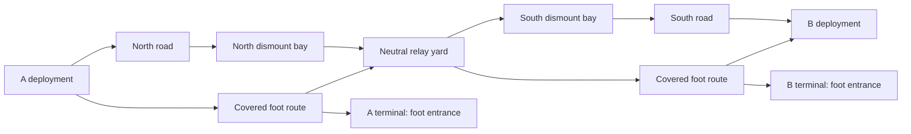

# Mobile Forces 2027 — original combined-arms vertical slice specification

Version: **0.1, review draft**. Date: **2026-09-07**. Internal project identifier: `MobileForces2027`; public title is undecided. This document specifies future work. No Unreal project, game build, benchmark, native MCP connection, or Fable review has been completed in this workspace.

## 1. Recommendation and intended outcome

Build an original spiritual successor to Mobile Forces in **Unreal Engine 5.8.2**, the latest released hotfix found in the official sources checked for this research. Qualify Epic's new **native experimental Unreal MCP**, backed by checked-in editor Python/C++ content tools and native UBT/UAT build/test automation. Use Astra for implementation/integration and Fable for independent design and implementation review. [Epic 5.8.2 release](https://forums.unrealengine.com/t/5-8-2-hotfix-released/2746335), [Epic Unreal MCP](https://dev.epicgames.com/documentation/unreal-engine/unreal-mcp-in-unreal-editor)

The first deliverable is a complete **4v4 playable slice on native Apple Silicon Mac and Windows x64**, with one map, a carried-objective mode, infantry bots, weighted loadouts, a two-seat wheeled transport, and passenger shooting. A Windows dedicated server is part of technical acceptance; Mac and Windows also support local/listen-host play. The user explicitly requested Mac and Windows from the start. Intel Mac is outside the first supported hardware matrix.

“One shot” means one implementation kickoff that can continue through staged generation, compile, playtest and repair loops without redesigning every subsystem. It does not mean a single model completion or a promise of a finished commercial game without iteration. This specification makes the first coherent result bounded and testable, while preserving a larger roadmap.

**Document authority:** user decisions > reviewed changes recorded in `DECISIONS.md` during implementation > this spec > [ACCEPTANCE.md](ACCEPTANCE.md) and [BUILD-RUNBOOK.md](BUILD-RUNBOOK.md) for execution details > research alternatives. Until implementation begins, proposed filenames/classes/tools are contracts to create, not claims that they exist. If two normative requirements conflict, record and resolve the conflict before writing dependent gameplay; do not silently pick whichever is easier.

## 2. Product pillars and reference boundary

The original's useful identity is the connection between infantry firepower, movement burden, accessible vehicles, passengers and team objectives. Research from the original manual is separated from store-description discrepancies in [GAME-DESIGN.md](research/GAME-DESIGN.md). Exact original map layouts, branding, art, audio and narrative are not inputs to reuse.

| Pillar | Required player experience | Proof in the first slice |
|---|---|---|
| Infantry matters | A player on foot can fight, flank, defend and counter transport | Cover routes, readable weapons, rocket counter, useful foot-only entrances |
| Mobility changes decisions | A vehicle saves travel time and creates exposure/coordination tradeoffs | Measured route advantage, driver/passenger coordination, visible vulnerable occupants |
| Firepower has a cost | A heavier kit moves more slowly and makes transport valuable | Two clear kits, displayed mass/speed, authoritative movement modifier |
| Team objectives create motion | Players retrieve, escort, intercept, plant and defend | Neutral core plus enemy terminal, contested paths, role-based bots |
| Play without a populated server | A solo player can start and finish a meaningful match | One human + seven bots, bot fill on departures, functioning objective behavior |
| Modern readability | Controls, hits, state, teams and objectives are understandable quickly | Consistent UI/audio/shape cues, settings, clear errors and results |

Desired tone: grounded but stylized industrial action, readable silhouettes, responsive arcade movement, low narrative overhead. Modernization comes first from responsiveness, usability, reliable networking and coherent presentation. Photorealism is optional later.

## 3. Scope and release levels

### V0.1 mandatory

- One original arena, **Quarry Exchange**, approximately 420 m × 280 m, fixed daylight, no streaming requirement.
- One original mode, **Relay Breach**, adapted from the neutral-objective/vehicle/team-attack idea with explicit new rules below.
- Eight active combatant slots, four per team, any mix of humans and bots; no local split screen.
- Offline local authority with bot fill; LAN/direct-connect listen server on either OS; dedicated Windows authority with both native clients.
- First-person infantry, third-person driver camera, passenger first-person aim, two loadout presets, rifle/pistol/rocket, health/death/respawn.
- One two-seat unarmed wheeled transport archetype, one per team initially, passenger rifle/pistol fire, damage/destruction/respawn, and one authored bot shuttle loop per team.
- Infantry bots that use bounded perception, fight, seek/carry/drop/plant/defend/disarm the core, and navigate the map.
- Main menu, solo/host/join, loading/error state, HUD, scoreboard, results/rematch, mouse/keyboard rebinding and saved settings.
- Reproducible native packages, test evidence, performance measurements, content generation and recovery instructions.

### Explicitly later

8v8/16v16, multiple maps/modes, APC/turret/boat/aircraft/trailers, general off-road bot driving, destructible buildings, terrain deformation, fuel/repairs, armor classes, projectile penetration, prone/lean/climb, inventory looting, character classes/abilities/GAS, full controller parity/aim assist, progression/accounts/unlocks, ranked play, public matchmaking/NAT traversal, Steam/EOS integration, voice/text chat, anti-cheat service, mods, Linux dedicated deployment, consoles/mobile, cloud autoscaling, monetization, final commissioned art, localization beyond English, public signing/store release.

These are scope exclusions for the first slice, not declarations that they are undesirable. Preserve extension points without implementing unused frameworks. Public internet acceptance will require an additional threat/latency/operations design; direct IP on a trusted test network is sufficient for V0.1.

### Deliverable levels

| Label | Meaning |
|---|---|
| Foundation | Toolchains, automation and native empty package proof |
| Graybox complete | All gameplay pillars function with placeholder visuals, including networking |
| V0.1 accepted | Native packages meet the full acceptance matrix and basic presentation/feel review |
| Public alpha | Separate licensing, signing, distribution, online-service and external QA gates |

A visually attractive editor scene is not graybox complete. A working graybox may be delivered while presentation work remains, but must carry the correct label.

## 4. Key architecture decisions

| ID | Selected decision | Reason / reconsideration condition |
|---|---|---|
| D01 | UE 5.8.2 provisional exact baseline; lock build/SDK/plugin identity | Current released engine + native tooling; upgrades require rerunning foundation/vehicle/platform gates |
| D02 | Minimal C++ game foundation, thin presentation Blueprints/data assets | Small custom rules and possession model; less integration surface than importing a full shooter framework |
| D03 | Lyra as architecture reference, not an initial dependency | Valuable shooter examples but GAS/Experience/Game Feature/pawn lifecycle adds work; revisit only if a same-version spike demonstrably reduces total integration effort |
| D04 | CharacterMovement for infantry; ordinary actor/property replication | Use established engine behavior; no custom character prediction rewrite |
| D05 | Conventional wheeled Chaos vehicle candidate behind explicit G3 qualification | Narrow transport requirement; plugin maturity and real network behavior must be measured |
| D06 | No Mover, Chaos Modular Vehicles, required Iris, or GAS in V0.1 | Avoid stacking migration/experimental or unused framework commitments; this is a project choice, not a claim that every alternative is unsuitable |
| D07 | Server-authoritative game rules, seats, hits, ammo, objective and scoring | Cross-client consistency and hostile-input rejection |
| D08 | Editor Python/C++ recipes own generated content; one editor operator | Repeatability and recoverability of binary assets |
| D09 | Native Epic MCP qualified first; CLI/scripts remain sufficient | Tool failure must not invalidate the gameplay build path |
| D10 | Mac/Windows share a conservative medium renderer | Functional parity without unsupported Mac features |
| D11 | UMG + Enhanced Input; introduce CommonUI only for a measured need | First slice prioritizes keyboard/mouse and a small menu stack |
| D12 | Windows dedicated server first; Linux deployment later | Early true remote authority without making a third native toolchain mandatory |

Detailed evidence and alternatives are in [ENGINE-ARCHITECTURE.md](research/ENGINE-ARCHITECTURE.md), [UNREAL-AUTOMATION.md](research/UNREAL-AUTOMATION.md), and [PLATFORMS-AND-AGENTS.md](research/PLATFORMS-AND-AGENTS.md). In particular, conventional Chaos vehicle tooling also has experimental classification in current Epic references; “conventional” does not mean independently production-qualified.

## 5. Player flow

Launch → main menu → Solo Skirmish, Host LAN or Join Address → select preset/team preference → load map → spawn → play → results → rematch or menu.

Solo Skirmish starts without login, internet, model API or dedicated server setup. Host LAN creates a listen match and fills unused slots. Join accepts host address and port through a validated UI field, reports connection progress, and handles timeout/version mismatch/full server gracefully. No console command is required for normal joining.

Initial team assignment keeps human-count imbalance ≤1 where capacity permits; bots fill to four. Joining replaces one bot on the assigned team through an orderly retirement: drop its core, release seats, remove its pawn and controller, then spawn the human. Bots do not count toward human capacity. A fifth human on one team is rejected/reassigned; a ninth human is rejected. No spectator overflow or party system in V0.1.

Solo pause freezes authoritative world time, physics, bot decisions and every match/interaction/respawn/lease timer. Use consistent world-time clocks, not mixed wall-clock deadlines. Online Escape opens a local menu while the match continues. The UI distinguishes these behaviors. A paused local world cannot accept remote clients until resumed/converted through the host flow.

Human disconnect retires that pawn and releases ownership immediately, then schedules a replacement bot on the same team. Do not transfer the disconnected player's health, carried objective or occupied vehicle to an invisible replacement. Rejoining is a fresh session; no persistent reconnect reservation in V0.1.

## 6. Infantry and loadouts

### Movement defaults

All values below are **original tuning seeds**. Store them in data assets/config and test invariants. Unreal world units are centimetres; map recipe coordinates below are metres and must be converted exactly once.

| Parameter | Initial value / rule |
|---|---|
| Health | 100 integer health; no regeneration or armor in V0.1 |
| Base walk/run | 600 cm/s; normal movement uses this cap |
| Sprint | 1.35 × current weighted speed; cannot fire or ADS; no stamina system |
| Crouch | 0.55 × weighted speed; capsule clearance required to stand |
| ADS | 0.65 × weighted speed, rifle/pistol only |
| Jump | CharacterMovement jump; initial `JumpZVelocity` candidate 420 cm/s, tune collision/feel |
| Burden | Preset total mass is constant during a life; firing ammo does not change speed |
| Weight multiplier | `clamp(1 - 0.02 * max(0, MassKg - 8), 0.70, 1.0)` |
| Core | +4 kg while carried, including while entering/exiting a seat |
| Scout preset | Rifle + pistol, 8 kg, 600 cm/s before stance |
| Demolition preset | Rifle + rocket launcher, 18 kg, 480 cm/s before stance |
| Spawn kit change | Select for next spawn; no combat-time loadout swapping |
| Sprint/fire | Fire cancels sprint; no shot before permitted weapon state |
| Interact | Hold or tap according to target action; aim trace + distance + LOS checked by server |

Replicate the selected preset/core carrier state and derive weighted speed from authoritative data. Implement any necessary prediction support for stance/weight transitions through the selected CharacterMovement extension points in the pinned engine. Changing a local `MaxWalkSpeed` is not an authority check. UI should explain the current speed tradeoff in plain language.

### Weapon seeds

| Attribute | Rifle | Pistol | Rocket launcher |
|---|---|---|---|
| Fire | Automatic hitscan | Semi-auto hitscan | Single server projectile |
| Damage | 25 body, 1.5× head | 20 body, 1.5× head | 100 maximum infantry radial; vehicle tuning below |
| Cadence | 600 rpm (0.100 s) | 300 rpm max (0.200 s) | 1 round, reload 3.2 s |
| Magazine / reserve | 30 / 90 | 12 / 48 | 1 / 2 |
| Reload | 2.2 s | 1.5 s | 3.2 s |
| Effective behavior | Full damage ≤80 m, linear down to 15 at 160 m | Full ≤35 m, down to 12 at 80 m | 60 m/s; no homing; max lifetime 4 s |
| Hard range | 200 m | 100 m | Travel limited by lifetime/collision |
| Spread seed | 0.35° ADS / 1.5° hip; moving ×1.5 | 0.5° ADS / 1.8° hip | Direction from validated aim |
| Passenger use | Yes, allowed arc | Yes, allowed arc | No |

No penetration or destructible cover. Apply range/target/head multipliers, then round nonnegative damage once to integer with `floor(value + 0.5)`; zero remains zero. A 37.5-damage rifle headshot therefore applies 38. Rifle: four body hits from full health at close range, ideal interval from first hit to fourth 0.3 seconds; animation/recoil/aim and latency will change real outcomes. Treat this as a fast arcade seed, subject to human review. Add visible recoil with recovery and a short hit indicator; damage remains determined by the server. Camera traces cannot shoot through a wall immediately in front of the muzzle.

Rocket explosion radius seed: 450 cm, full infantry damage inside 100 cm, linear falloff to zero; require an unobstructed explosion-to-target damage trace. Vehicle radial maximum is 250; a direct vehicle impact receives a single 250 damage resolution, not direct plus duplicated splash. Infantry self-damage enabled, teammate damage disabled for this slice. Rifle vehicle damage 2 and pistol vehicle damage 1 per accepted hit. Store these target-class damage values explicitly.

Projectile impact can trigger once. Deduplicate impact callbacks/explosion application with a server-owned projectile ID and exploded flag. Owner prediction may display a cosmetic projectile and reconcile with the real one; it cannot assign hits. Suppress duplicate muzzle/tracer/explosion effects on the owning client.

### Weapon state machine and requests

`Unequipped → Equipping → Ready → Firing/Reloading → Ready`; `Dead` or `SeatedDriver` stops firing/reload and rejects new actions. Switching cancels reload without granting ammunition. Ammo moves at successful reload completion, clamped by magazine and reserve. Holding fire through reload resumes only if the authoritative input/fire state still permits it.

Fire requests include monotonic shot/input ID, weapon ID and aim intent; the server resolves shooter, equipped weapon, ammo, cadence, alive/seat state and legal aim/muzzle transform. Use server-issued MatchId, RoundId, PlayerLifeId, EquipRevision and vehicle generation/seat revision where applicable, so delayed commands cannot act after respawn, re-equipping or vehicle recycling. Maintain a bounded deduplication window per connection/generation; old generations are rejected rather than replaying an obsolete successful response. Reject stale/repeated IDs, impossible cadence, invalid vectors and non-owned weapons. The first slice uses current server collision time with bounded aim validation, **no historical hitbox rewind**. This is an explicit fairness limit under latency, not a hidden “lag compensation” claim. Address wider-latency competitive hit registration before public alpha.

## 7. Vehicles and seats

### Transport seed

One original two-seat light open transport archetype. No mounted turret. Driver controls motion; passenger fires permitted personal weapons. Initial top speed 18 m/s, target acceleration 0→15 m/s in 4–6 s, reverse 6 m/s, health 500. Wheelbase/rig/torque/gear/suspension values must be tuned from actual asset geometry; this spec does not invent a universally valid Chaos rig configuration.

Each team has one spawner. Empty non-destroyed abandoned vehicles return after 30 s without occupants, regardless of damage, only if no enemy of the original spawner team is within 20 m; otherwise retry after 5 s. That proximity rule uses original allocation even though empty-vehicle damage allegiance is neutral. Return retires the old vehicle and creates a fully restored replacement at the pad; it cannot overlap a blocked pad. Destroyed vehicle wreck remains 8 s then is removed; replacement spawns 20 s after destruction if pad clear. Defer if pad blocked, retry every 2 s without spawning into pawns. At most one live vehicle per spawner, including one waiting to retire. Unoccupied team vehicles may be stolen by the other team; a vehicle with living occupants cannot accept a hostile occupant.

Vehicle damage allegiance is the current occupants' shared team, independent of the original spawner. Empty vehicles are neutral and damageable by either team. A stolen occupied vehicle is hostile to the original team. Friendly shots do not damage an occupied friendly transport; the spawner ownership still controls replacement allocation. This prevents stolen vehicles inheriting accidental immunity.

Use case: light kit can flank on foot; heavy kit uses transport; passenger covers approach; both dismount before the narrow final objective entrance. A vehicle must beat the comparable foot route sufficiently to matter without bypassing all counterplay.

### Seat contract

States: `OnFoot`, `Entering`, `Driver`, `Passenger`, `Exiting`, `Dead`. The server seat roster is authoritative. Only short request processing is transient; do not hold a seat reservation forever while waiting for an animation.

- Seat 0 driver; seat 1 passenger. Entry within 250 cm of a valid entry anchor, unobstructed LOS, alive pawn, free seat, eligible team occupancy and vehicle speed ≤3 m/s. Resolve contention atomically on server order. Repeated request IDs return the already resolved outcome.
- Requests go through the persistent owning PlayerController, with expected vehicle/seat revision. Never rely on a soon-to-be-unpossessed Character RPC to finish a seat transition.
- Driver possesses the vehicle. Retain and attach the original character body; disable walking collision/movement while retaining dedicated server query hit primitives for body/head. Derive seated hit primitives from authoritative vehicle/seat transforms, or prove server skeletal pose updates; do not rely on rendered bone ticks. Record original pawn/controller explicitly. Damage resolves against the retained body reference even when `PlayerController.GetPawn()` is the transport.
- Passenger retains Character possession, with CharacterMovement disabled while seated and the character attached to its seat. Retain server query hit primitives as for the driver. Its normal owned weapon component handles permitted fire; authoritative aim/muzzle origin derives from seat/vehicle transform plus validated aim, not a stale walking transform. Do not have two human controllers possess the same vehicle.
- Separate owner-only camera/input changes from authoritative seat changes. Reconcile attachment, collision, ownership and HUD when replication references arrive in different orders. Replication order is not a transaction guarantee.
- Driver cannot fire. Passenger yaw seed ±110° around seat forward, pitch −50° to +65°. Clamp server aim to the allowed arc and enforce muzzle obstruction against vehicle geometry/world. Third-person body and weapon must show a plausible shot direction.
- Exit allowed only at speed ≤3 m/s. Test driver/passenger side anchors, rear anchor and a bounded nearby fallback against capsule sweeps, floor support and bounds. Require a clear swept route through the seat's authored open egress corridor to the candidate, not just an unoccupied final capsule. Ignore only documented own-vehicle shapes necessary for that open corridor; never ignore world walls. If no safe exit exists, stay seated and show `Exit blocked`; do not teleport through walls or strand a hidden pawn.
- Manual seat swap is excluded. Exit and re-enter the desired seat. The UI displays available seat and control hints.
- Occupant death clears its seat once. Driver death/disconnect immediately neutralizes throttle and applies handbrake. Surviving passenger remains a passenger until a legal exit/re-entry.
- Vehicle destruction kills seated occupants through the normal damage/death path, drops the core to a valid ground point and clears controller/seat references once. Use vehicle-local cached anchors if the visual wreck has already changed. The explosion cannot trigger duplicate score/death/core transitions.
- A flipped vehicle moving below 1 m/s for 5 s enables an occupant recovery hold of 3 s. Server sweeps a valid upright placement nearby; succeed visibly or report blocked. Recovery grants no health/ammo and drops the core to validated ground before moving the vehicle.

Attach bodies/seat state under a single server revision, but treat revision as coherence metadata rather than an atomic network packet. Client reconciliation must wait for missing referenced actors and rerun when they appear. Late join, relevance loss and re-entry must reconstruct the same occupancy without historical RPC playback.

### Physics decision gate

Start with the conventional wheeled Chaos plugin and its documented/native input path. Test a remote driver at measured latency, dedicated authority, collisions, passenger attachments and native Mac/Windows execution. No parallel custom transform multicast or unvalidated client authority path is allowed.

If the candidate fails G3 after an isolated reproduction and bounded repair effort, the fallback is **a deliberately simpler arcade transport movement implementation with server authority, client input prediction/reconciliation and the same seat interfaces**. That fallback is itself a substantial task requiring its own prototype; it is not an automatic cheaper substitute or an excuse to remove prediction. Record the tradeoff and obtain a scope decision if it changes delivery expectations. Preserve a functioning non-network test fixture for diagnosis, but never mark it a networked transport.

## 8. Relay Breach rules

The following are new game rules. They are not an assertion that the original Detonation mode behaved identically.

### Match and round

Two teams of four. A match is first to three successful breaches, with a 12-minute active-play limit. Pregame warmup is 10 s after the first human loads; solo may skip warmup. Warmup prevents objective/scoring but allows movement. Round reset is 8 s and pauses the match clock. Solo/listen postmatch results wait for host rematch/menu. A dedicated server shows a 20 s results countdown and automatically starts a fresh match if a human remains connected; otherwise it returns to waiting. Rematch never requires a developer console.

Each round starts with a neutral relay core at map centre, unarmed terminals at both bases, all players alive at team starts, refilled preset ammo/health, and reset vehicles. Destroy old round actors before spawning replacements. Every round increments `RoundId`; delayed RPCs/timers from older rounds are rejected.

| Phase | Authoritative action permissions |
|---|---|
| Waiting | Menu/loadout/team flow only; no live score/objective/vehicle simulation |
| Warmup | Move/look inside deployment; no damaging fire, ammo consumption, seat entry or objective interaction; start resets players to anchors |
| Active / Overtime | Ordinary rules; overtime blocks new pickup/install and resolves only its already armed objective |
| RoundReset | Look/UI only; freeze movement/control, cancel holds/reload/fire, retire projectiles and clear transient state before respawn |
| Finished | Results/UI only, no damage or interaction; halt/reset vehicles and clear projectiles/held actions |

Every phase transition stops held fire/interaction and increments the relevant generation. Require fresh input after reset/start rather than carrying a previous round's held action into the new pawn. The server eligibility checks include phase; client input disabling alone is insufficient.

### Core and terminal state

Core states: `AtCentre`, `Carried`, `Dropped`, `Installed`, `Resetting`. At most one logical core exists per round. The replicated core state includes `RoundId`, `Revision`, state, carrier PlayerState reference if any, terminal/team reference if installed, world/drop transform and reset deadline.

1. **Acquire:** an alive on-foot player holds interact within 150 cm with LOS for 0.5 s. If simultaneous, the server processes one winner; the other receives a clean occupied response. Driver/passenger cannot acquire from the ground while seated.
2. **Carry:** carrier gains 4 kg burden. They may fire/sprint under the normal weighted rules and may ride/drive. Show the carrier to teammates; show all players a core location marker updated every 2 s, with an explicit stale-marker style. Do not create a continuous enemy-wallhack marker through the HUD by accident. A team possession lease lasts 75 s from acquisition; same-team drop/reacquire does not extend it, opposing acquisition starts a new lease, and installation ends it. Lease expiry returns the uninstalled core to centre even if carried or seated, removing burden. This prevents indefinite vehicle keep-away. The lease continues while dropped; ground return or round reset clears it.
3. **Drop:** explicit drop, death, disconnect, out-of-bounds or invalid carry state releases the core. Validate a supported in-bounds position; otherwise return centre. Dropped core returns centre after 20 s unless picked up. Either team may acquire it. Core pickup/return cannot revive an old round's state.
4. **Install:** carrier must be on foot, at the **enemy** terminal, within 150 cm and LOS, holding interact for 3 s. Install consumes the carried state and arms that terminal for 25 s. The terminal is reached through a foot-only entrance. Only one terminal can be armed because only one core exists.
5. **Defuse:** any living defending on-foot player holds interact at the armed terminal for 4 s. Success disarms and returns the core to centre after a 2 s reset delay; it does not award a breach point or reset the round.
6. **Breach:** if the countdown expires without completed defuse, the attacking team gains one point. Trigger a localized terminal effect and round reset; no collar narrative or mapwide collateral-damage simulation. Win check occurs before reset.

Interaction is canceled by releasing input, dying, leaving distance/LOS, entering a seat, losing the core where required, target/revision change, or taking positive damage. Hold progress resets, never pauses/persists. Only one active interacting player per core/terminal action; clear the interaction on disconnect. Authoritative start/end times drive UI; clients do not submit completed progress.

Resolve due events by their authoritative effective timestamps, not callback/tick order. At equal timestamps apply death/cancellation/invalid-owner cleanup first, breach second, eligible interaction completion third, lease/ground-return expiry fourth, and ordinary match-time expiration last. A defuse scheduled at 24.990 s beats breach at 25.000 s even if both are first observed at the 25.010 s tick; an exactly equal defuse loses. Record cancellation timestamps on server receipt/observation, never a backdated client claim. A plant completed at or before the ordinary match deadline is processed before overtime evaluation. A prior lease expiry invalidates a later install. Inject a clock into rule tests and exercise overshot ticks and exact ties.

### End of match and exceptional cases

- At match deadline with no armed terminal, highest breach score wins; equal score is a draw. A carried/dropped core alone does not create overtime.
- An armed terminal at match deadline creates overtime only for that active countdown/defuse resolution. After defuse, immediately evaluate current scores. After breach, add the point then immediately evaluate scores; no additional round follows. Equal final score may still be a draw.
- Maximum overtime is the remaining armed countdown; no replant in overtime. If the installation completes at the deadline, the plant-first rule above permits that countdown.
- If all humans leave, a dedicated match closes/resets to waiting state after 30 s; bots do not consume an unattended match forever. A listen host leaving ends the session and clients return to menu with an explanation; no host migration.
- Rematch is a full match revision change. Clear timers, projectile/damage/interaction state, AI targets, scores, seat rosters and spawn reservations. Settings persist; match inventory and core do not.
- Network disconnect, late join and server travel reconstruct state from replicated snapshots and current server time. Do not rely on a one-off multicast “core planted” event to initialize a joining client's HUD.

## 9. Respawn, scoring and fairness

Death disables weapon/interaction/seat input immediately on authority and schedules respawn after 5 s. No ragdoll replication requirement; cosmetic ragdolls may be client-local for up to 5 s. Death score increments once per life; suicides have no kill credit. Assist credit is deferred.

Use at least eight candidate spawn anchors per team, within protected deployment pockets. Reject occupied capsules, out-of-bounds points and points with an enemy within 15 m; strongly penalize direct enemy LOS within 50 m. Choose the best remaining candidate using stable seeded tie-breaking. After 5 s without an eligible normal anchor, consider additional reserved anchors in an interior deployment pocket protected by visible team-locked shutters/geometry from enemies, vehicles and direct fire. The reserved anchors must remain separated enough that four teammates cannot obstruct every candidate. Sweep them too; if no safe point exists, report `Spawn blocked` and retry rather than overlap geometry. This pathological state is a map acceptance failure. Provide an initial 2 s spawn protection that ends on firing, entering a vehicle, picking up the core, or leaving a 5 m deployment radius. Protected players cannot deal damage until protection is ended for that shot.

No damage from friendly bullets, rockets or vehicle collisions. Self rocket damage applies. Vehicle-to-infantry ramming damage is excluded in V0.1; collision must push/block safely without an unreviewed roadkill mechanic. Scoreboard: team breach score, player kills, deaths, objective actions and latency. Personal statistics are informational; only breaches decide the match.

## 10. Map recipe: Quarry Exchange

Original small industrial quarry/logistics site. Author the map in centimetres using a recipe with explicit metre conversion; x is west/east, y south/north, z up. Bounds x ±210 m, y ±140 m. Baseline terrain z=0, selected ramps/overlooks no higher than 6 m. Use conventional static meshes, simple colliders and a baked/validated navigation volume. World Partition is unnecessary at this scale.

| Element | Metre-space seed | Constraint |
|---|---|---|
| Team A deployment | (−180, 0, 0) | Protected pocket, exits north/south, no shot directly to B |
| Team B deployment | (+180, 0, 0) | Mirrored gameplay dimensions, different visual signposting |
| A/B terminals | (−155, 0, 0), (+155, 0, 0) | Foot-only entrance, two approach angles, no spawn-room line of fire |
| Neutral core | (0, 0, 0) | Open central loading yard, cover around perimeter, no single dominant overlook |
| Transport pads | (−177, +25, 0), (+177, −25, 0) | Clear 10×7 m pad, egress anchors outside spawn collision |
| North vehicle route | y≈+80 m, x from −175 to +175 | 9–12 m wide, broad turns, no unavoidable jump, cover breaks |
| South vehicle route | y≈−80 m | Comparable travel time, different cover rhythm |
| Central foot path | y around 0 with cover chicanes | 4–6 m traversable corridors, 3 m minimum narrow entries |
| Mid-route dismount bays | x≈±70, y≈±65 | Vehicle cover plus safe pedestrian route into central fight |
| Low overlooks | x≈±65, y≈±30, z≤6 | Two access routes; cannot see both spawn interiors/core/terminal simultaneously |
| Enemy-terminal road cutoff | Final 20–30 m approach | Physical bollards/width make dismount necessary, collision and nav agree |

The diagram is topological; the coordinate recipe determines geometry. Roads exist on both sides for both teams, despite the simplified drawing. Preserve nearly symmetric functional travel times (within 10%) before introducing asymmetrical art. Aim for first infantry contact in 15–25 s and transport arrival at a useful central dismount in 12–18 s from spawn including boarding. Measure actual routes rather than dividing Euclidean distance by top speed.

Cover dimensions: waist cover about 1.1 m, full cover 2.2–3 m; gaps should allow readable peeking without snagging capsules. Break long road sightlines roughly every 40–70 m. No invisible collision walls except the explicit world boundary with warning. No blind kill volumes inside normal travel space. Validate every objective from both deployment pockets by nav path and human traversal.

The recipe owns tagged generated actors only. Preserve authored art in a separate namespace/sublevel or explicit manifest entries. Re-running generation must neither duplicate actors nor wipe manual art. Export a semantic manifest of IDs, class, transform, bounds, collision profile and references for review.

## 11. Bots

Use server-side `AIController`, navigation, AI Perception and a small Behavior Tree/Blackboard or equivalent explicit C++ task state. Choose one representation for shared decisions. No LLM inference at game runtime. Bots use the same health, inventory, seats, weapons, interaction eligibility and objective services as humans.

Perception seeds: sight 60 m, lose sight 70 m, field of view 100°, reaction delay 0.3–0.6 s, memory of last seen location 3 s. Bots may know publicly announced core/terminal state like a human, but not hidden enemy transforms. Burst rifle fire with aim error that settles gradually; do not target perfect headshots. Rocket use requires a valid enemy vehicle, LOS, safe distance and ammunition.

Roles per team: one runner, one escort, one defender and one flex, recalculated every 2 s or on important state change. Human actions influence role gaps: if a human carries the core, bots escort/defend instead of fighting them for it. Runner seeks core/enemy terminal; defender protects own terminal and prioritizes defuse; escort follows a bounded offset/cover point; flex intercepts or joins the nearest useful role. Roles are intentions, not exclusive abilities.

Nav paths are infantry paths. The bot driver uses authored route nodes and arrival/steering/speed targets, bounded obstacle stop/backoff, and a 10 s stuck timeout leading to a safe stop and dismount. Each team needs a base→central bay→base shuttle route. No arbitrary Recast path is fed directly into wheeled steering. Passenger bot boards through the seat service, may fire legal weapons, dismounts at the bay, and resumes infantry objectives.

Infantry stuck policy: detect <1 m progress toward a navigation goal over 5 s while movement is requested; attempt alternative reachable goal/path, then retry role assignment. If still stuck after 15 s, a development report records it; only an off-camera controlled respawn may recover after 20 s, with no core/seat duplication or score reward. Recovery events count against bot reliability acceptance; frequent recovery is a bug, not success.

## 12. Runtime classes, ownership and data

Use a runtime module `MobileForces2027`, an editor module `MobileForces2027Editor` only if needed, and a development test module/target excluded from Shipping. Compile editor utilities separately; no runtime module may depend on `UnrealEd`, Python, ToolsetRegistry, MCP or custom authoring code.

| Proposed type | Responsibility | Replication / persistence |
|---|---|---|
| `UMFGameInstance` | Session flow, local settings integration, connection failures | Local lifetime across maps; never owns authoritative score |
| `AMFGameMode` | Admission, spawn/bot fill, round/match transitions | Server only |
| `AMFGameState` | Match revision, phase/deadlines, scores, current objective snapshot | Replicated to all |
| `AMFPlayerState` | Team, player identity, kills/deaths, selected next-spawn preset | Replicated appropriate public data; no secrets |
| `AMFPlayerController` | Owned commands, camera/input mode, persistent seat request entry | Owning client/server |
| `AMFCharacter` | Movement/body/camera/seat presentation hooks | CharacterMovement plus authoritative state |
| `UMFHealthComponent` | Damage policy, health, single death transition | Server writes; health/death state replicated |
| `UMFWeaponComponent` | Equip/fire/reload/ammo rules | Server authority; owner ammo/state; cosmetic events for others |
| `AMFRocket` | Validated projectile motion/impact/explosion | Server authority; replicated/cosmetic reconciled representation |
| `AMFTransport` | Wheeled movement, health, seat roster, physics state | Driver input via selected native path; server owns state |
| `UMFSeatComponent` | Atomic seat admission/exit and reconciliation metadata | Server writes roster revision; clients reconcile |
| `AMFRelayCore` / `AMFRelayTerminal` | Objective world representation/interaction anchors | Authoritative state service; presentation from snapshots |
| `AMFAIController` | Perception, role/task scheduling, legal actions | Server only |
| `UMFMatchRules` or plain rule helpers | State transition functions with injected time | Unit-testable, no view/widget dependency |
| `UMFUserSettings` | Input/display/audio/accessibility settings | Per-user native writable path, versioned local schema |

Define interfaces by intent, such as `IMFInteractable` query/eligibility/start/cancel and `IMFDamageable` authoritative damage application. Do not expose Blueprint setters that permit clients to bypass the authoritative service. Presentation delegates may observe state without changing it.

Data assets: `MFWeaponDefinition`, `MFLoadoutDefinition`, `MFVehicleDefinition`, `MFMatchDefinition`, `MFMapDefinition`, `MFBotTuning`. Stable IDs reference assets; avoid fragile display-name lookups. Include all runtime soft-referenced definitions in the cook/Asset Manager policy and verify resolution in packages. Keep UI labels separate from enum/asset identifiers.

### Networking contract

Start at 30 Hz server tick, with high-frequency movement handled by the selected engine systems. Objective/score/seat changes are event-driven replicated state with server timestamps. Do not replicate UI countdowns every frame. Use relevance/dormancy for inactive actors and force relevant updates for seats/death/core changes where appropriate. Do not implement a custom Replication Graph for eight players before profiling proves need.

Reliable RPCs are for bounded state transitions where appropriate, with per-controller validation and rate limits. Cosmetic repeated fire effects must not flood reliable channels. Prefer the engine's established vehicle input mechanism to an independently invented per-tick reliable RPC. Treat transient network loss, repeated commands, stale round/seat revisions and out-of-order actor creation as normal test cases.

V0.1 network performance target: nominal LAN and a measured 100 ms RTT, 20 ms peak-to-peak added jitter, 1% packet-loss profile. Configure impairment deliberately in one harness location and record whether values apply one-way or round-trip; do not double-apply client and server packet lag. Add a harsh 200 ms RTT/3% loss exploratory run with no-crash/no-corruption requirements and explicitly unguaranteed feel.

Cross-OS play uses identical content/rule/network builds. Never disable engine network-version validation simply to connect mismatched packages. No client claim may directly set position, damage, score, ammo, objective completion, seat occupant or team. Engine movement input is still server validated; inspect the selected replication path rather than assuming replication implies anti-cheat.

## 13. Presentation, controls and accessibility

Main HUD: central crosshair; health lower left; weapon/ammo lower right; team scores and clock top; current objective instruction and world marker; interaction progress; seat/speed/vehicle health when applicable. Scoreboard is a hold/toggle view with clear team separation and local player highlight. Results state winner/draw and a short objective summary.

Default mouse/keyboard: WASD move/drive, mouse aim/look, left click fire, right click ADS, R reload, Space jump/handbrake in vehicle, Shift sprint, Ctrl crouch, E interact/enter/exit, 1/2 weapon selection, G drop core, Tab scoreboard, Escape pause/settings/menu. Avoid accidental overlapping bindings across input contexts. Driver camera can orbit within a bounded rear view; returning to on-foot restores prior sensitivity/FOV/context.

Settings: horizontal FOV 80–110, default 95 with aspect handling documented; sensitivity; invert Y; toggle/hold ADS/crouch/sprint; key rebinding with collision resolution; master/music/SFX volume; resolution/display mode; quality preset; VSync/frame cap; reduced camera shake; motion blur off by default; team palette alternatives; UI scale 80–140%. Save on apply and survive restart. A failed/corrupt settings load restores safe defaults and reports locally without blocking launch.

Use team color **and** shape/text marks. Objective warning is visual and audible. Do not depend on red/green contrast, subtle color changes, tiny world text, or sound alone for match-critical information. Core marker stale state must be visible. Menus support keyboard focus and Escape/back without trapping mouse capture. Test alt-tab/focus, high-DPI/Retina, 16:9 and 16:10, and screen edges.

Visual content floor for V0.1: distinguish teams at 40 m, identify a transport/occupant at 60 m, show weapon type and firing direction, provide seated poses rather than a standing body through the roof, and show no missing material checkerboards. Use a simple shared material palette and coherent industrial signage. First-person hands/weapon and third-person held weapons need correct sockets. Low-cost placeholders may be visibly simplified but must satisfy these readability/pose constraints.

Sound floor: own/remote weapon distinction, hit/damage feedback, footsteps, engine idle/load, skid/impact, enter/exit, core acquire/drop, plant/defuse/countdown, round result. Use licensed/generated/project-authored placeholder sounds with provenance; no original game audio. Cap simultaneous voices and distance attenuate noncritical sounds. No voice cloning or speech-model dependency.

## 14. Performance, platform and storage targets

Targets are acceptance goals, not measured engine promises. Reference Mac: the observed M-series 24 GB system, on AC power, one packaged client, shared medium preset at 1920×1080 output; specify internal resolution/upscaler mode in the report. Windows reference runner must be named at G0; a proposed baseline is a modern six-core CPU, 16 GB RAM and an RTX 3060/RX 6600-class GPU, subject to actual availability. That class is a planning target, not a certified minimum specification.

For an eight-combatant match with two live transports, objective activity and combat effects after a 60 s warmup: target median frame time ≤16.7 ms, p95 ≤22.2 ms, p99 ≤33.3 ms in a 10-minute rendered capture. Record hitches >100 ms separately; no recurring hitch more than once per minute after warmup. Server tick p95 ≤33.3 ms with no persistent backlog at 30 Hz. Report both client and listen-host costs; local bots/server load can make a listen host slower.

Track resident/committed memory with platform-specific measurement named; target client peak ≤6 GiB and server ≤2 GiB for this slice, with no sustained growth >10% after the first completed match across a three-match soak. GPU/unified memory figures are not directly interchangeable. Track native CPU/GPU times and memory pressure separately. Target cooked client archive ≤5 GiB before optional art; exceeding it requires an asset-size review, not arbitrary deletion of required content.

Use conventional LOD meshes, modest dynamic lights, fixed lighting conditions and capped effects. Default textures 1K/2K with explicit exceptions; simple physics collision; limit expensive transparency and unique materials. These are initial content guardrails, refined by actual profiling. Do not use null rendering, a minimized viewport or a headless bot server as evidence of rendered client performance.

This Mac has only limited free space at the research snapshot and lacks a configured full Xcode at the standard path. Engine/caches/build storage must be provisioned before attempting the run. See the platform research for native toolchain and capacity allowances. No disk cleanup or installations have been performed.

## 15. Verification and evidence

[ACCEPTANCE.md](ACCEPTANCE.md) defines named tests, invariants and reports. Required layers: pure rules, engine-integrated functional/content checks, native multi-process networking, rendered package behavior, cross-OS sessions, performance, content rebuild/reopen, and human playtest.

An evidence record contains test ID, timestamp, source/content/package hashes, engine/build identity, OS/hardware, process topology, configured/measured latency, seed, inputs, expected result, authoritative observations, actual result, log/report/screenshot/video paths and unresolved limits. Status values: `PASS`, `FAIL`, `BLOCKED`, `NOT_RUN`; no blank or implied pass.

The editor automation service must be explicitly absent from all delivered client/server packages. Epic's native plugin contains runtime server modules; simply calling a plugin “editor tooling” does not remove it. Test plugin dependency/cook/module reports and listening sockets at runtime. No required game operation can call Python, MCP, an LLM API or a developer console.

The gate order, failure recovery, command templates and implementation kickoff are in [BUILD-RUNBOOK.md](BUILD-RUNBOOK.md). Fable's review packet is [FABLE-REVIEW.md](FABLE-REVIEW.md). This draft may be reviewed immediately without installing Unreal.

## 16. Risks and decision triggers

| Risk | Early signal | Response |
|---|---|---|
| Vehicle physics/prediction or seats exceed viable scope | G3 jitter, broken ownership, unreliable egress | Isolate and repair before art; evaluate simpler transport architecture explicitly |
| Mac platform/plugin issues | Native compile/cook failure or missing plugin module | Use native tools/scripts, remove optional plugin dependency, keep Mac requirement |
| Source engine/dedicated build cost | Storage/build time or incompatible build identities | Provision known matching builds early; do not defer discovery to final acceptance |
| Bots produce empty or unfair matches | Idle/stuck behavior, perfect hidden knowledge, no plants | Instrument perception/roles and objective paths; tune before adding content |
| “Polish” grows without a playable loop | New art systems before G4 | Complete the loop and performance baseline first |
| Agent editor corruption | Duplicate assets, stale editor state, timeout retries | Single lease, semantic recipes, saved checkpoints and replay receipts |
| Asset/branding rights unclear | Missing provenance or ripped content | Use original placeholders; select properly licensed replacement |
| One-shot expectation turns into false completion | PIE-only/video-only reports | Enforce named native package and network gates |
| Original feel missing despite passing tests | Transport ignored, weight irrelevant, objective static | Human pillar playtest; revise tuning/routes, preserve explicit rules |

## 17. Roadmap after the slice

V0.2: validate 8v8 on the same map or a resized variant; improve bot driving; introduce a second weapon/vehicle role only after counterplay and networking tests. Add historical hitbox rewind if wider-latency playtests justify the complexity. Revisit GAS/Lyra only for a real growing ability/class need, not as a cosmetic refactor.

V0.3: second map, second objective mode, controller parity, better animation/audio/art, Linux dedicated server and repeatable unattended server operations. Maintain the same native Mac/Windows regression suite.

Public alpha: select Steam/EOS or another online layer with verified Mac SDK support, user identity/session flow, matchmaking/NAT plan, anti-cheat/support policy, abuse/reporting design if communication features exist, crash reporting with consent/data minimization, signing/notarization, asset/branding/license review, release/distribution plan, load/cost tests and external playtest coverage.

Commercial scope and schedule should be re-estimated using observed production rate and playtest response from V0.1. Do not convert this research specification into a shipping-date promise.

## 18. Review questions that matter most

Can the 4v4 slice actually demonstrate the original's vehicle/infantry identity? Is two-seat passenger shooting sufficiently central and sufficiently testable? Are the current-server hit rules acceptable for a closed playtest? Are possession, objective timers and death/disconnect effects consistent? Is dedicated authority worth the early source-engine cost? Does Mac remain first-class through actual packages and shared performance targets? Can the content/rig pipeline start without unavailable purchases? Are any mandatory rules underspecified or contradictory?

Fable should return ranked blockers and concrete corrections, not merely a larger feature list. The detailed review prompt asks for accepted, rejected and unresolved recommendations so the implementation brief remains coherent after review.
